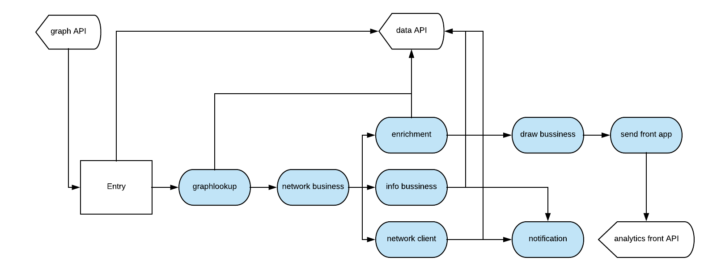
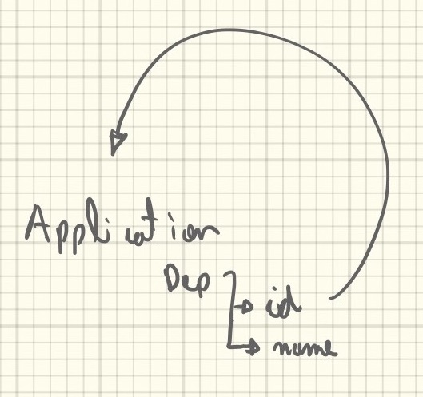
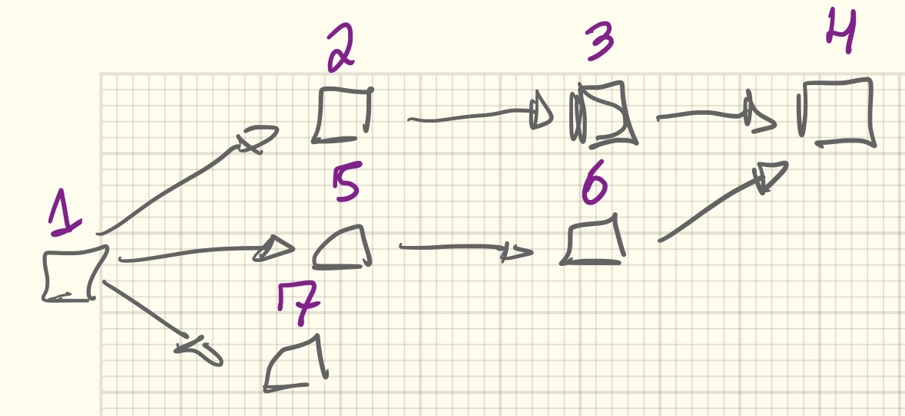
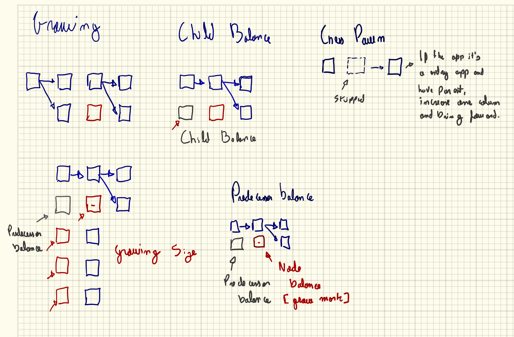
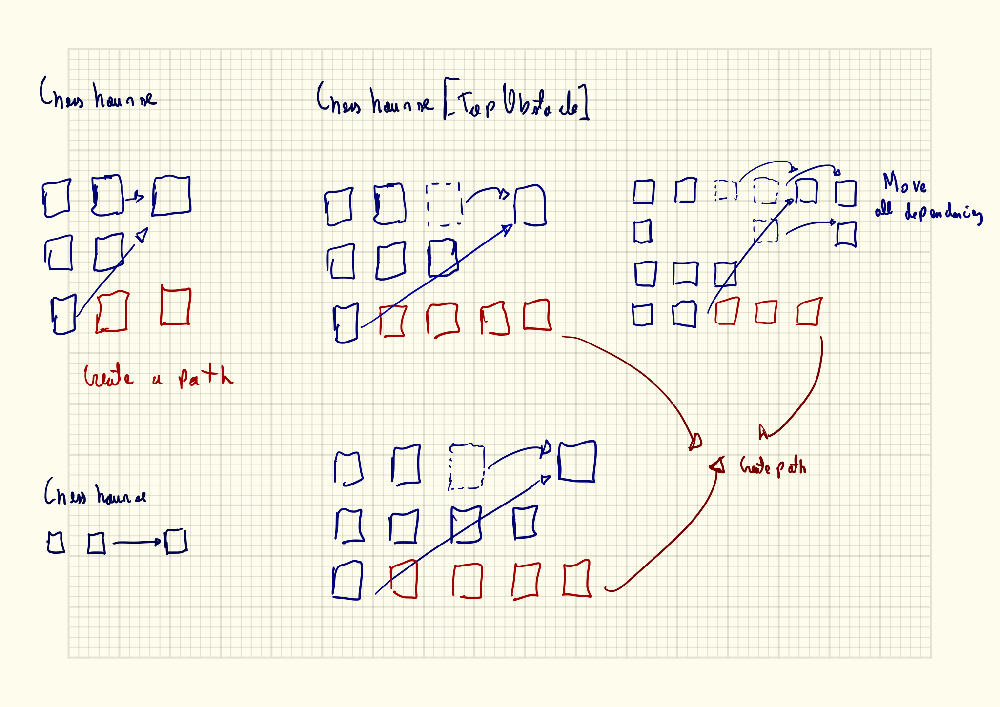
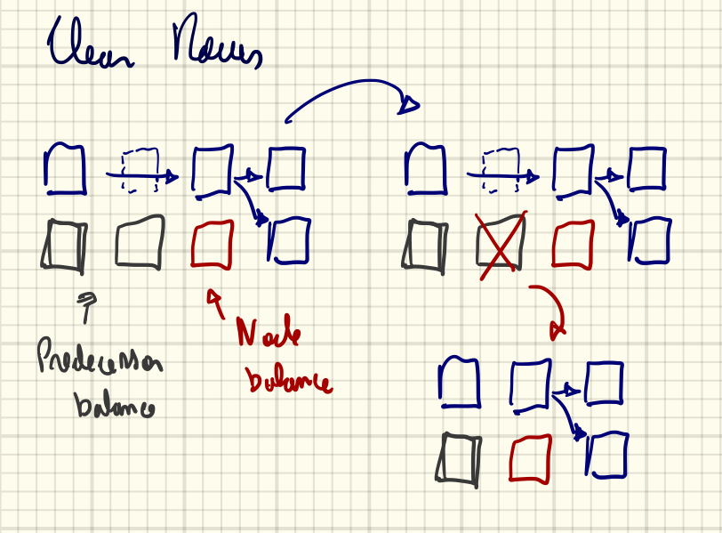
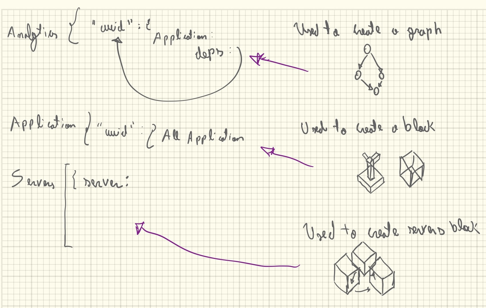
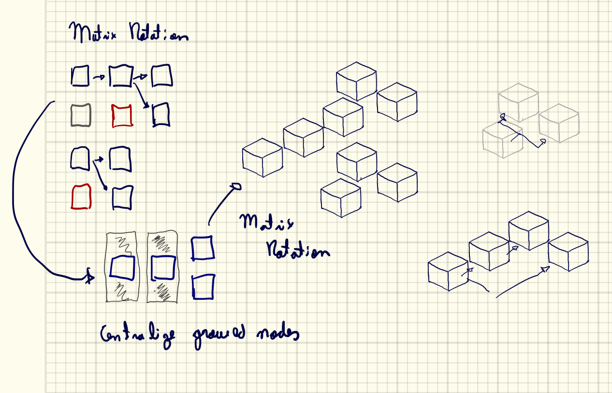
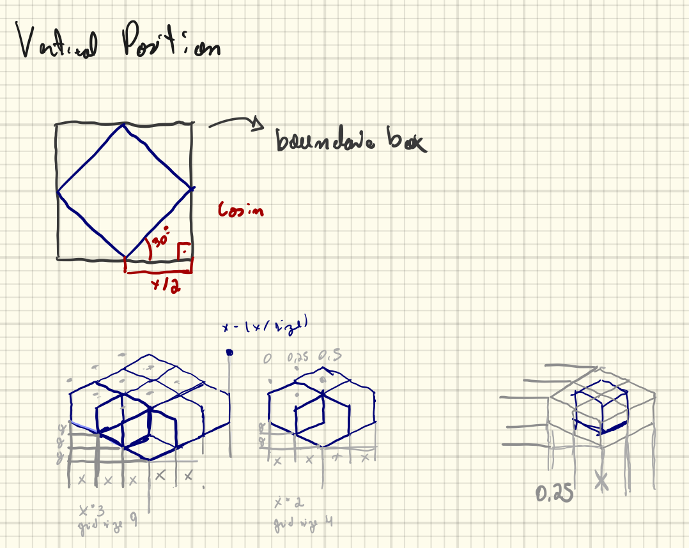

Algorithm Graphs Analytics
==========================

This section will expose how the create of analytic graph works.

 - High level work flow

----------

Making the mongodb graph lookup
-------------------------------

The graph lookup creates a python dict using mongodb graph, and all application entities have a dep field this field have a app objects with `id` and `name`.

----------

Creating a networkX graph
-------------------------

After graph sends to network business, basically transform python object to networkX.

We have a recursive function inside each node on the tree, this order will apply a lot of rules creating a new graph tree with better UI order, like in these moments we handle with conflicts, double dependencies, orders and etc.

Code example showing the recursive function

.. code-block:: python

    def _recursive_draw(self, app, i=0, OHelper=HelperOrderedSuccers):
        if i > 30:
            return

        for item in app:
            if not self._grid.in_index(item):
                node = self._graph.nodes[item]
                helper = self.add_pos_grid(node)

                succ = OHelper(helper).get_succers()
                self._recursive_draw(succ, i + 1)

In these graphs we can see all rules applied on graph to create a best dependency tree. 
Each recursive tick try to figure out certainty pattern, if found apply a transformation. 
For example The child balance pattern try to find a multiple child in one parent, if happen then create a dummy item on parent layer.

-----

Rules
-----

**Growing node**

	- **When:** If the node have more than one child, growing the node to be equal of the number of child
	- **Transform:** Set the node size to be equal of number of child

**Child Balance**

	- **When:** If the parent node have more than two child.
	- **Transform:** Create a dummy item beside to node parent.

**Chess Pawn**

	- **When:** If the app it's an entry point and have parent.
	- **Transform:** Skipped one column

**Chess horse**

	- **When:** If the node have a top obstacle which other nodes point out to a common dependency.
	- **Transform:** First push back the dependency to a clear column, and after create a dummy path to the new column.

**Clear rows**

	- **When:** After finish the recursive loop, figure out empty columns.
	- **Transform:** Delete these column and rebalance the grid.

----------

Enrichment data
---------------

Next step is an enrichment layer with getting all server data used by each graph.

The enrichment step received two dataset a json python dict represents a graph tree, a matrix position grid. 
One worker will get all applications accordingly with graph tree creating a new dataset called servers.

----------

Draw layers
-----------

Now its draw time, where we have three datasets, one its a graph tree, second its matrix od each position and the last its list of servers.

