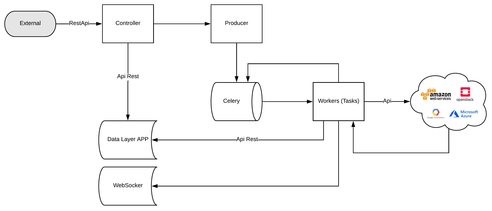
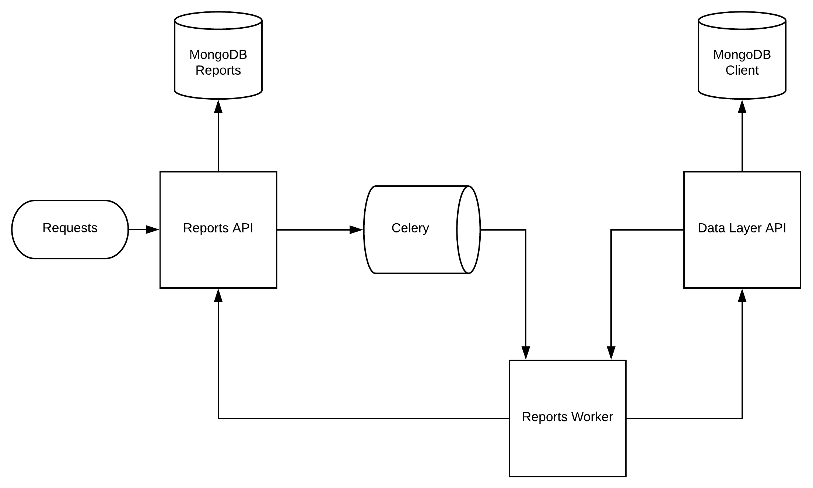

Architecture
====================

Macro Map
---------

Services relation, each service comunite by `rest` (http) calls.

.. image:: ../_static/screen/arch_1.png

Client App
----------

The front end is written with:

====================== ===========================================================================
Vue2                   Main framework, using by react and manager views, routes and temaplates, 
                       use vue-loader with webpack                                   
Webpack2               bundler generate                                                                                                                       
Bootue                 All micro components, like buttons, tables, forms and etc, 
                       its 100% Bootstrap3 components built with Vue2, 100% standalone, no query.  
Nginx                  Using for proxy reverse                                                                                                                
Mocha / Chai / Sinon   Test, asserts and mock library.                                                                                                        
====================== ===========================================================================

----------

**Vue2 Macro Architecture**

.. image:: ../_static/screen/client_arch.png

**Important topics**

- Front end application is divided in:

	- **src/pages:** templates and bussiness rules (domain layer)

	- **resources:** factories, modals, and cache managers (infrastructure layer)

----------

A single folder structure components normally use:

.. image:: ../_static/screen/client_component.png

----------

Server App
----------

We using DDD to organize the code, has infra, repositories, entities (values objects), interfaces, application, and domain, if like to learn read this article is very cool `DDD in Node Apps <https://blog.codeminer42.com/nodejs-and-good-practices-354e7d763626>`_ 

.. image:: ../_static/screen/fluxo_data.png

Server its have constructed with `KrakenJs <http://krakenjs.com/>`_, we create a lot of middleware and organize by domain.

**Setup dev env**

.. code-block:: bash

    cd devtool/

    docker-compose up -d

Will be setup mongodb and fake smtp server

Discovery App
-------------

Discovery using `Flask <http://flask.pocoo.org>`_,  and python >3.5, has api rest, and tasks.

**Setup dev env**

.. code-block:: bash

    cd devtool/

    docker-compose up -d

Will be setup rabbitmq and redis

**Windows Env**

If you use windows, celery havent support for windows, the last version is 3.1.25.

.. code-block:: bash

    pip3 install celery==3.1.25

    npm run powershell

**Important topics**

- Controller used factory dc abstract to create easy way to make CRUD in mongodb

- The crawler is divided in 3 parts

	- **api:** connect in api provider and get result

	- **translate:** normalize the data

	- **insert:** insert/update data in mongodb

	Each step have unique task.

- Config is managed by env variables, need to be, because in production env like k8s is easier to manager the pods.

- Repository has pymongo objects.

----------

**Flower - Debbug Celery**

We installed a flower, it's a control panel to centralize results throughout rabbitMQ, very useful to troubleshooting producer and consumers.

.. code-block:: bash

    flower -A app.celery

    npm run flower

----------

Scheduler App
-------------

.. image:: ../_static/screen/scheduler.png

Discovery using `Flask <http://flask.pocoo.org>`_,  and python >3.5, used Celery Beat feature to call tasks.

----------

Reports App
-------------

.. image:: ../_static/screen/microservice_arq.png

Reports using `Flask <http://flask.pocoo.org>`_,  and python >3.6, used Celery Beat feature to call tasks, have strong dependences with discovery app and server app, reports use a standalone MongoDB (only reports app see this db).

**Important topics**

- Controller used factory task to organize the workflow report generetaion.

- The process is divided in 4 parts

    - **general/pivot:** prepare and select result (communicate with discovery api)

    - **notification:** notificate any message (use discovery app to do)

    - **upload:** control flow data (throttle inserets)

    - **webhook:** insert/update data in mongodb or an y endpoint
