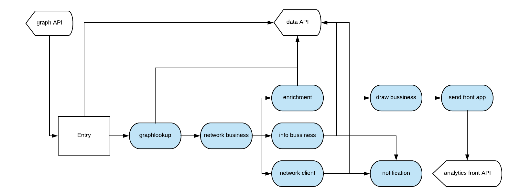

Analytics Maestro
-----------------

Analytics App is a module to analytics graph and create xml of Maestro Server, yours responsibility is: 

- Create grids
- Create bussiness graph
- Create network graph
- Create infra graph
- Drawing
- SVGs

----------

Analytics using `Flask <http://flask.pocoo.org>`_,  and python >3.5, has api rest, and tasks.

**Setup dev env**

.. code-block:: bash

    cd devtool/

    docker-compose up -d

Will be setup rabbitmq and redis

**Windows Env**

If you use windows, celery havent support for windows, the last version is 3.1.25.

.. code-block:: bash

    pip3 install celery==3.1.25

    npm run powershell

**Important topics**

- Controller used only graph to start all tasks:

- The drawer process is compound by:

    - **entry:** First task, figure out all entry applications accordingly system endpoint parameters, our any direct application if avalaible.

    - **graphlookup:** Request for Data App a aggregate query using MongoDB $graphLookup.

    - **network bussiness:** Construct Grid Map, and send to enrichment and info bussines.

    - **enrichment:** Request for Data App all servers used on grid.

    - **info bussiness:** Calculate histogram, counts, density and connections.

    - **network client:** Request for Data App all clients used in grid.

    - **draw bussiness:** Create svgs based of grid.

    - **notification:** Send updates for Data App.

    - **send front app:** Send svgs to Analytics Front app.

	Each step have unique task.

- Config is managed by env variables, need to be, because in production env like k8s is easier to manager the pods.

- Repository has pymongo objects.

----------

**Flower - Debbug Celery**

You can install a flower, it's a control panel to centralize results throughout rabbitMQ, very useful to troubleshooting producer and consumers.

.. code-block:: bash

    pip install flower

    flower -A app.celery

    npm run flower

----------

**Installation with python 3**

    - Python >3.4
    - RabbitMQ

Download de repository

.. code-block:: bash

    git clone https://github.com/maestro-server/discovery-api.git

----------

**Install  dependences**

.. code-block:: bash

    pip install -r requeriments.txt

----------

**Install  run api**

.. code-block:: bash

    python -m flask run.py

    or

    FLASK_APP=run.py FLASK_DEBUG=1 flask run

    or 

    npm run server

----------

**Install  run rabbit workers**

.. code-block:: bash

    celery -A app.celery worker -E -Q analytics --loglevel=info

    or 

    npm run celery

----------

.. Warning::

    For production environment, use something like gunicorn.

    .. code-block:: python

        # gunicorn_config.py

        import os

        bind = "0.0.0.0:" + str(os.environ.get("MAESTRO_PORT", 5020))
        workers = os.environ.get("MAESTRO_GWORKERS", 2)

----------

**Env variables**

=========================== ============================ ============================
Env Variables                   Example                    Description         
=========================== ============================ ============================    
MAESTRO_PORT                 5020                         Port
MAESTRO_DATA_URI             http://localhost:5010        Data Layer API URL
MAESTRO_ANALYTICS_FRONT_URI  http://localhost:9999        Analytics Front URL
MAESTRO_SECRETJWT_ANALYTICS  xxxx                         Used with Analytics Front
MAESTRO_NOAUTH               xxxx                         Used for post auth Front
MAESTRO_GWORKERS             2                            Gunicorn multi process
CELERY_BROKER_URL            amqp://rabbitmq:5672         RabbitMQ connection
CELERYD_TASK_TIME_LIMIT      10                           Timeout workers
=========================== ============================ ============================
