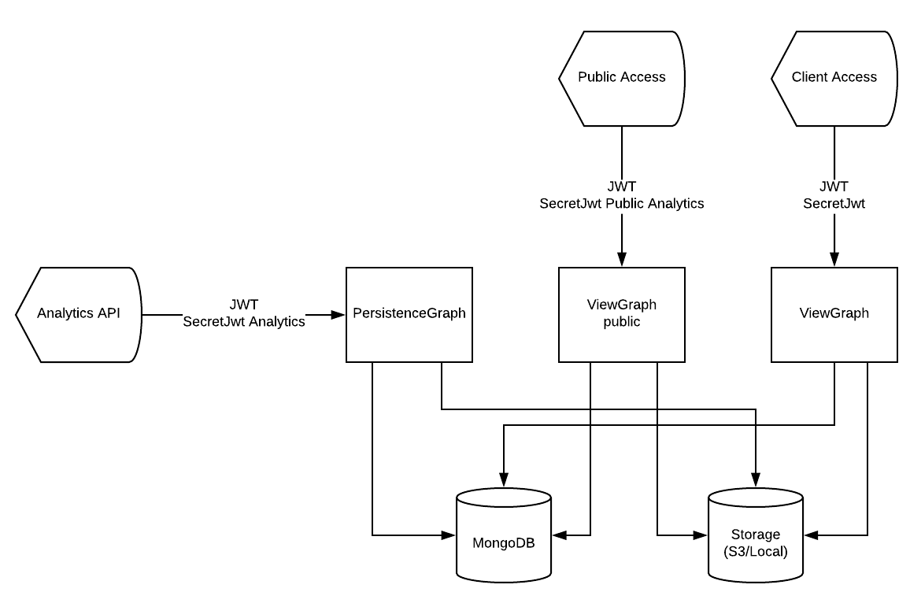

Analytics Front
---------------

Analytics Front App is front end of analytics graph of Maestro Server, yours responsibility is:

- Authentication
- Show graphs SVGs
- Upload internal SVGs of analytics

.. Warning::
	This service can be external access

----------

We using DDD to organize the code, has infra, repositories, entities (values objects), interfaces, application, and domain, if like to learn read this article is very cool `DDD in Node Apps <https://blog.codeminer42.com/nodejs-and-good-practices-354e7d763626>`_ 

.. image:: ../../_static/screen/fluxo_data.png

Analytics its have constructed with `KrakenJs <http://krakenjs.com/>`_, we create a lot of middleware and organize by domain.

Core API, organized by modules:

- Core
- Authetication
- Graph
- View

----------

**Installation with node**

    - Nodejs 8 or above
    - MongoDB 3.4
    - RabbitMQ
    - AWS S3 (If using S3 upload)

Download de repository

.. code-block:: bash

    git clone https://github.com/maestro-server/analytics-front.git

----------

**Install  dependences**

.. code-block:: bash

    cd analytics-front
    npm install

----------

**Configure some env variable**

create .env file

.. code-block:: bash

    MAESTRO_PORT=9999
    MAESTRO_MONGO_URI='localhost'
    MAESTRO_MONGO_DATABASE='maestro-client'

and

.. code-block:: bash

    npm run server

----------

**Multiple env**

Every config can be pass by env variables, but if you like, can be organize by .env files,

=================== ================================
       Name                     Desc                                             
=================== ================================
 .env                Default
 .env.test           Used on run test
 .env.development    node_env is setted development
 .env.production     node_env is setted prodcution
=================== ================================

**Migrate setup data**

create .env file

.. code-block:: bash

    npm run migrate

----------

For production environment, need to use pm2 or forever lib.

Like (PM2):

.. code-block:: bash

    npm install -g pm2

    # Create a file pm2.json

    {
    "apps": [{
        "name": "analytics-front",
        "script": "./server.js",
        "env": {
            "production": true,
            "NODE_ENV": "production",
            "PORT": 9999
        }
    }]
    }

.. code-block:: bash

    pm2 start --json pm2.json

----------

**Env variables**

================================== ========================== ============================================== 
            Env Variables                   Example                   Description                          
================================== ========================== ==============================================
MAESTRO_PORT                        9999                                                   
API_URL                             http://localhost:8888      Server app Url               
NODE_ENV                            development|production                                 
MAESTRO_MONGO_URI                   localhost                  DB string connection         
MAESTRO_MONGO_DATABASE              maestro-client             Database name   

MAESTRO_SECRETJWT                   XXXX                       Secret key - server app         
MAESTRO_SECRETJWT_PRIVATE           XXX                        Secret Key - JWT private connections       
MAESTRO_NOAUTH                      XXX                        Secret Pass to validate private connections
MAESTRO_SECRETJWT_PUBLIC	        XXXX	                   Secret key - same server app 

AWS_ACCESS_KEY_ID                   XXXX                                                   
AWS_SECRET_ACCESS_KEY               XXXX                                                   
AWS_DEFAULT_REGION                  us-east-1                                              
AWS_S3_BUCKET_NAME                  maestroserver                                          
MAESTRO_UPLOAD_TYPE                 S3/Local                   Upload mode                  
LOCAL_DIR                           /public/static/            Where files will be uploaded 
PWD                                 $rootDirectory             PWD process                  
================================== ========================== ==============================================
