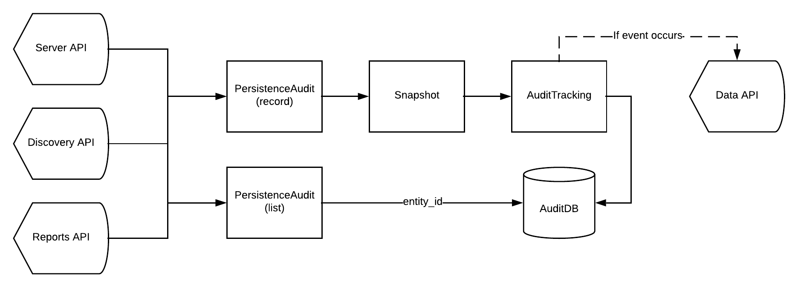

Audit App
---------

Audit App is webapp application port of Maestro Server stack, yours responsibility is:

- Control and manage changed data on Maestro
- Show a tree of changed entities
- Store and control data changes
- Trigger hooks based in changed rules

----------

We using DDD to organize the code, has infra, repositories, entities (values objects), interfaces, application, and domain, if like to learn read this article is very cool `DDD in Node Apps <https://blog.codeminer42.com/nodejs-and-good-practices-354e7d763626>`_ 

Server its have constructed with `KrakenJs <http://krakenjs.com/>`_, we create a lot of middleware and organize by domain.

Core API, organized by modules:

- Core
- Audit // make diff of each request
- Snapshot // hold last state of each entity

----------

**Installation with node**

    - Nodejs 8 or above
    - MongoDB 3.4
    - RabbitMQ

Download de repository

.. code-block:: bash

    git clone https://github.com/maestro-server/audit-app.git

----------

**Install  dependences**

.. code-block:: bash

    cd audit-app
    npm install

----------

**Configure some env variable**

create .env file

.. code-block:: bash

    MAESTRO_PORT=10900
    MAESTRO_MONGO_URI='localhost'
    MAESTRO_MONGO_DATABASE='maestro-audit'
    MAESTRO_DATA_URI="localhost:5005"

and

.. code-block:: bash

    npm run server

----------

**Multiple env**

Every config can be pass by env variables, but if you like, can be organize by .env files,

=================== ================================
       Name                     Desc                                             
=================== ================================
 .env                Default
 .env.test           Used on run test
 .env.development    node_env is setted development
 .env.production     node_env is setted prodcution
=================== ================================

**Migrate setup data**

create .env file

.. code-block:: bash

    npm run migrate

----------

For production environment, need to use pm2 or forever lib.

Like (PM2):

.. code-block:: bash

    npm install -g pm2

    # Create a file pm2.json

    {
    "apps": [{
        "name": "audit-app",
        "script": "./server.js",
        "env": {
            "production": true,
            "NODE_ENV": "production",
            "PORT": 10900
        }
    }]
    }

.. code-block:: bash

    pm2 start --json pm2.json

----------

**Env variables**

================================== ========================== ============================================
            Env Variables                   Example                   Description                          
================================== ========================== ============================================
MAESTRO_PORT                         10900                                                               
NODE_ENV                             development|production                                              
MAESTRO_MONGO_URI                    localhost                DB string connection 

MAESTRO_MONGO_DATABASE               maestro-audit            Database name                              
MAESTRO_TIMEOUT                      1000                     Timeout any http private request           
MAESTRO_DATA_URI                     http://localhost:5010    Data App - API URL 

MAESTRO_SECRETJWT_PRIVATE            XXX                      Secret Key - JWT private connections       
MAESTRO_NOAUTH                       XXX                      Secret Pass to validate private connections               
================================== ========================== ============================================
