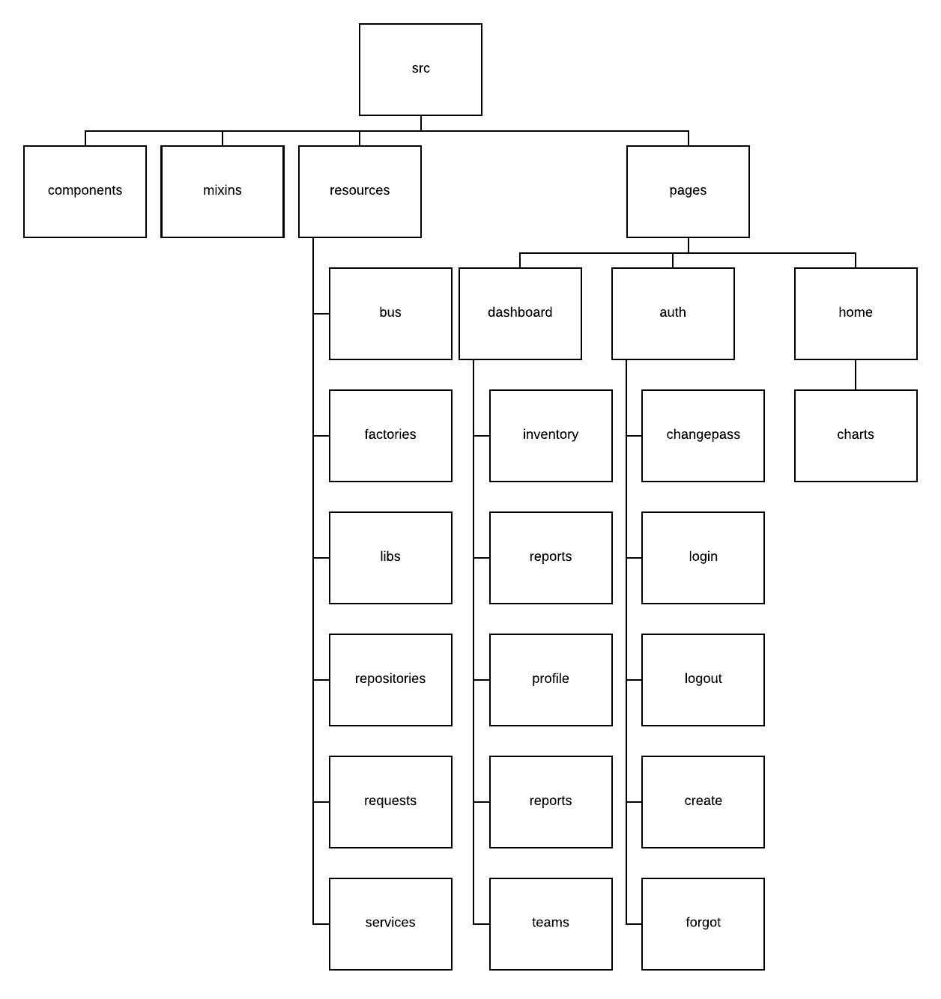
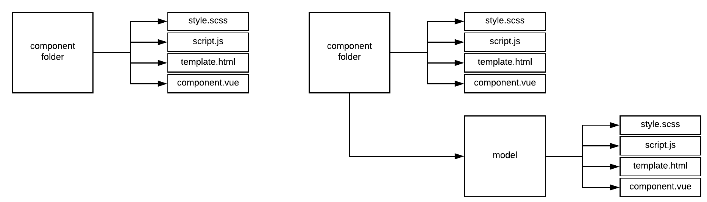

FrontEnd - Client App
---------------------

Client App front end application 

- Html and Js client application
- Single page app (SPA)
- Cache layer

.. Warning::
    This service needs a proxy reverse like nginx or haproxy.

----------

====================== ===========================================================================
Vue2                   Main framework, using by react and manager views, routes and temaplates, 
                       use vue-loader with webpack                                   
Webpack2               bundler generate                                                                                                                       
Bootue                 All micro components, like buttons, tables, forms and etc, 
                       its 100% Bootstrap3 components built with Vue2, 100% standalone, no query.  
Nginx                  Using for proxy reverse                                                                                                                
Mocha / Chai / Sinon   Test, asserts and mock library.                                                                                                        
====================== ===========================================================================

----------

**Vue2 Macro Architecture**

**Important topics**

- Front end application is divided in:

	- **src/pages:** templates and bussiness rules (domain layer)

	- **resources:** factories, modals, and cache managers (infrastructure layer)

----------

A single folder structure components normally use:

----------

**Installation with node**

    - Nodejs >= 7.4

Download de repository

.. code-block:: bash

    git clone https://github.com/maestro-server/client-app.git

----------

**Install  dependences**

.. code-block:: bash

    npm install

----------

**Production  build**

.. code-block:: bash

    npm run build

----------

**Dev run**

.. code-block:: bash

    npm run dev

----------

**Env variables**

======================= ============================ =============================== 
Env Variables                   Example                    Description         
======================= ============================ =============================== 
API_URL                 http://localhost:8888        Server App Url                                           
STATIC_URL              /upload/                     Relative path of static content 
ANALYTICS_URL           http://localhost:9999        Analytics App Url        
LOGO                    /static/imgs/logo300.png     Logotype, (login page)
THEME                   theme-lotus                  Theme (gold|wine|blue|green|dark)
======================= ============================ =============================== 
