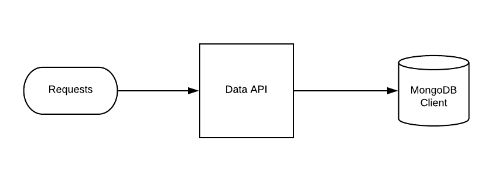

Data APP
---------------

Data app, database gateway micro service
- Request and response database operations

Simple Rest API using `Flask <http://flask.pocoo.org>`_ (python) + pymongo.

---------------

**Setup dev env**

.. code-block:: bash

    pip install

	FLASK_APP=run.py FLASK_DEBUG=1 flask run --port=5010

	or

	npm run server

---------------

Mongo service

.. code-block:: bash

    cd devtool/

    docker-compose up -d

Will be setup mongodb

----------

**Installation with python 3**

    - Python >3.4
    - MongoDB

Download de repository

.. code-block:: bash

    git clone https://github.com/maestro-server/data-app.git

----------

**Install  run api**

.. code-block:: bash

    python -m flask run.py --port 5010 

    or

    FLASK_APP=run.py FLASK_DEBUG=1 flask run --port 5010 

    or 

    npm run server

----------

.. Warning::

    For production environment, use something like gunicorn.

.. code-block:: python

	# gunicorn_config.py

	import os

	bind = "0.0.0.0:" + str(os.environ.get("MAESTRO_PORT", 5010))
	workers = os.environ.get("MAESTRO_GWORKERS", 2)

----------

**Env variables**

======================= ============================ ===========================================
Env Variables                   Example                    Description         
======================= ============================ ===========================================
MAESTRO_PORT			5000						 Port used 
MAESTRO_MONGO_URI       localhost                    Mongo Url conn
MAESTRO_MONGO_DATABASE  maestro-reports              Db name, its differente of servers-app     
MAESTRO_GWORKERS   		2       					 Gunicorn multi process  
MAESTRO_INSERT_QTD      200                          Throughput insert in reports collection
======================= ============================ ===========================================
