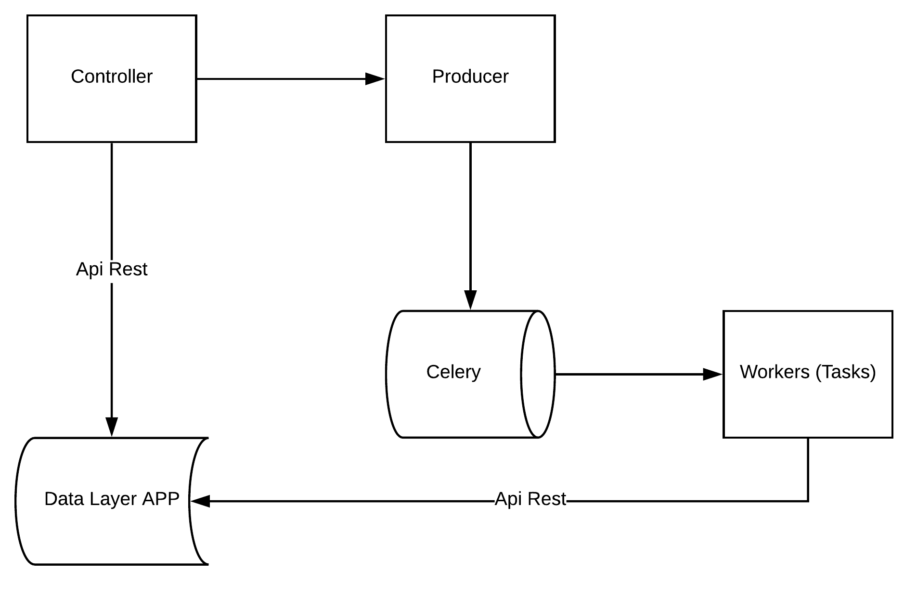
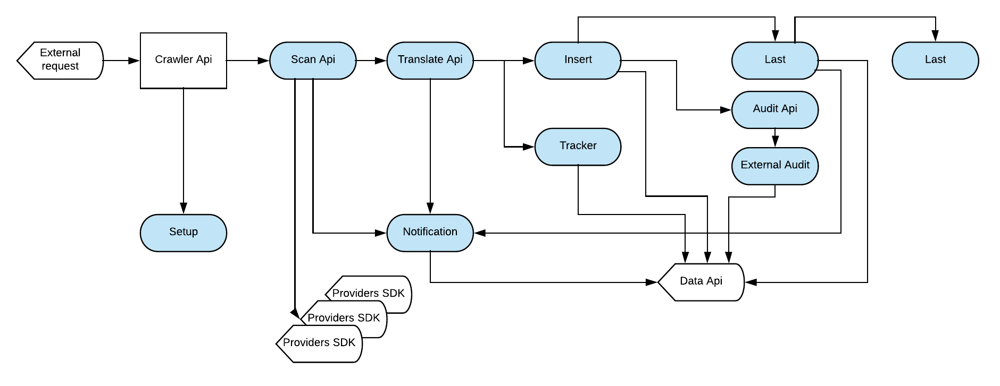
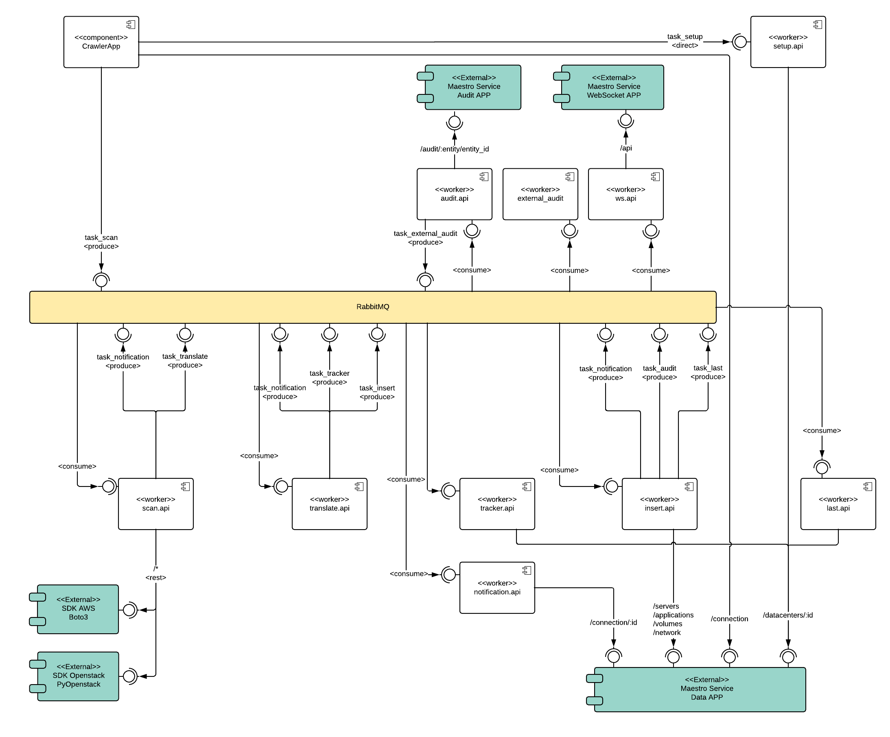

Discovery App
-------------

Discovery App is a crawler accountable to connect to cloud providers.

- To manager and authenticate on each cloud provider
- Translate cloud data to maestro data.

----------

Discovery app use `Flask <http://flask.pocoo.org>`_,  on python >3.5.

**Setup dev env**

.. code-block:: bash

    cd devtool/

    docker-compose up -d

**Highlights**

- The discovery are divided in modules:

    - **api:** To authenticate on cloud providers.

    - **translate:** Normalize the data.

    - **setup:** Reset the tracker stats (it used on datacenters to get the orphans instances)

    - **tracker:** recreate the tracker stats

    - **insert:** insert/update data on mongodb

    - **audit:** prepare and transform a data to send to the ``external audit``

    - **external_audit:** Send a http request to ``Audit app``

    - **ws:** Send a http notification to ``websocket api``

----------

**Components Diagram**

Follow an example of request flow.

----------

**Flower - Debug Celery**

Real-time monitoring using Celery Events

- Task progress and history
- Ability to show task details (arguments, start time, runtime, and more)
- Graphs and statistics

.. code-block:: bash

    pip install flower

    flower -A app.celery

    npm run flower

----------

**Installation with python 3**

    - Python >3.4
    - RabbitMQ

Download the repository

.. code-block:: bash

    git clone https://github.com/maestro-server/discovery-api.git

----------

**Installing dependencies**

.. code-block:: bash

    pip install -r requeriments.txt

----------

**Running**

.. code-block:: bash

    python -m flask run.py

    or

    FLASK_APP=run.py FLASK_DEBUG=1 flask run

    or

    npm run server

----------

**Running workers**

.. code-block:: bash

    celery -A app.celery worker -E -Q discovery --hostname=discovery@%h --loglevel=info

    or

    npm run celery

----------

.. Warning::

    On production we use gunicorn to handle multiple threads.

    .. code-block:: python

        # gunicorn_config.py

        import os

        bind = "0.0.0.0:" + str(os.environ.get("MAESTRO_PORT", 5000))
        workers = os.environ.get("MAESTRO_GWORKERS", 2)

