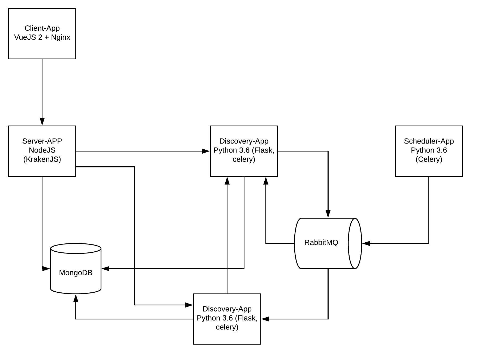

Architecture
====================

This section shows a advanced configurations for each micro service.

    **Constainerazed system:**
    Made with containers in mind, Maestro Server are deployed with Docker.

The services uses `rest` (http) calls to communicate between then.

----------

.. toctree::
   :maxdepth: 1

   client_app
   server_app
   discovery_app
   reports_app
   scheduler_app
   analytics
   analytics_front
   data_app
   audit
   ws_app