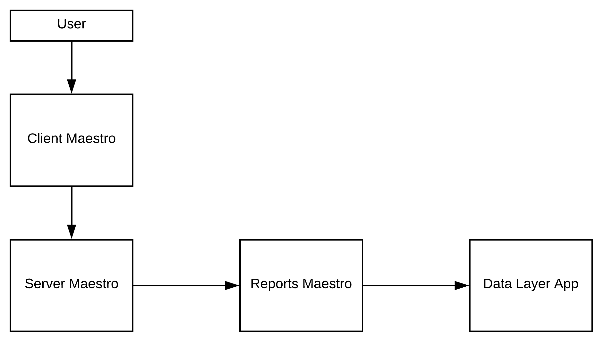
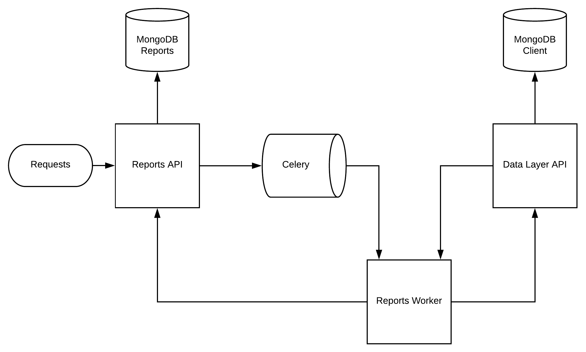

Reports App
-------------

Reports app, generate reports

- Understand complex queries and generate reports
- Manage storage and control each technical flow
- Transform in artifact pdf, csv or json

----------

Reports using `Flask <http://flask.pocoo.org>`_,  and python >3.6, used Celery Beat feature to call tasks, have strong dependences with discovery app and server app, reports use a standalone MongoDB (only reports app see this db).

**Important topics**

- Controller used factory task to organize the workflow report generetaion.

- The process is divided in 4 parts

    - **general/pivot:** prepare and select result (communicate with discovery api)

    - **notification:** notificate any message (use discovery app to do)

    - **upload:** control flow data (throttle inserets)

    - **webhook:** insert/update data in mongodb or an y endpoint

----------

**Installation with python 3**

    - Python >3.4
    - RabbitMQ
    - MongoDB

Download de repository

.. code-block:: bash

    git clone https://github.com/maestro-server/report-app.git

----------

**Install  run api**

.. code-block:: bash

    python -m flask run.py --port 5005 

    or

    FLASK_APP=run.py FLASK_DEBUG=1 flask run --port 5005 

    or 

    npm run server

----------

**Install  run rabbit workers**

.. code-block:: bash

    celery -A app.celery worker -E -Q report --hostname=report@%h --loglevel=info

    or 

    npm run celery

----------

.. Warning::

    For production environment, use something like gunicorn.

    .. code-block:: python

        # gunicorn_config.py

        import os

        bind = "0.0.0.0:" + str(os.environ.get("MAESTRO_PORT", 5005))
        workers = os.environ.get("MAESTRO_GWORKERS", 2)

----------

**Env variables**

========================= ============================ ===========================================
Env Variables                   Example                    Description         
========================= ============================ ===========================================
MAESTRO_MONGO_URI         localhost                    Mongo Url conn
MAESTRO_MONGO_DATABASE    maestro-reports              Db name, its differente of servers-app     
MAESTRO_DATA_URI          http://localhost:5010        Data layer api
MAESTRO_REPORT_URI        http://localhost:5005        Report api
MAESTRO_REPORT_RESULT_QTD 200                          Limit default
MAESTRO_TIMEOUT_DATA      10                           Timeout for data retrived
MAESTRO_TIMEOUT_WEBHOOK   5                            Timeout for notifications
MAESTRO_INSERT_QTD        20                           Prefetch data insert
MAESTRO_GWORKERS          2                            Gworkers thread pool                         
CELERY_BROKER_URL         amqp://rabbitmq:5672         RabbitMQ connection
========================= ============================ ===========================================
