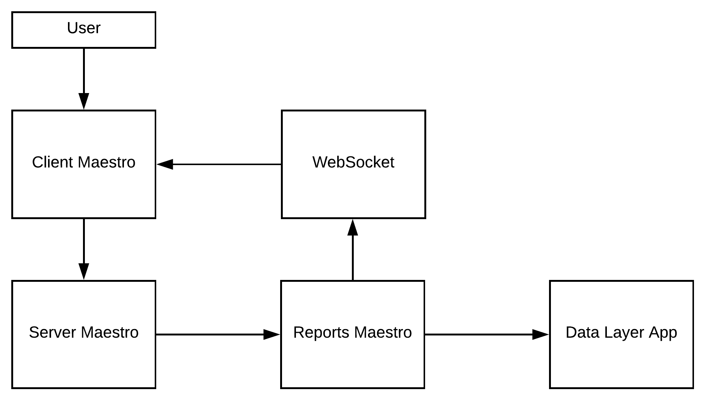

Reports App
-------------

Application to aggregate, filter and generate reports.

- Parse complex queries and generate reports
- Manage storage and control each technical flow
- Transform reports on artifacts such as pdf, csv or json
- Save results on database

----------

- Reports app use `Flask <http://flask.pocoo.org>`_,  on python >3.5.

----------

**Highlights**

- The module description:

    - **general/pivot:** get and filter data (communicate with discovery api)

    - **notification:** send a notification to data/audit services

    - **upload:** send results to the webhook

    - **webhook:** insert/update data on mongodb [report database]

    - **aggregation** - Execute aggregation tasks and save on report collections

    - **notify** - Send a notification to data app

----------

**Installation with python 3**

    - Python >3.4
    - RabbitMQ
    - MongoDB

Download the repository

.. code-block:: bash

    git clone https://github.com/maestro-server/report-app.git

----------

**Running**

.. code-block:: bash

    python -m flask run.py --port 5005

    or

    FLASK_APP=run.py FLASK_DEBUG=1 flask run --port 5005

    or

    npm run server

----------

**Running workers**

.. code-block:: bash

    celery -A app.celery worker -E -Q report --hostname=report@%h --loglevel=info

    or

    npm run celery

----------

.. Warning::

    On production we use gunicorn to handle multiple threads.

    .. code-block:: python

        # gunicorn_config.py

        import os

        bind = "0.0.0.0:" + str(os.environ.get("MAESTRO_PORT", 5005))
        workers = os.environ.get("MAESTRO_GWORKERS", 2)
