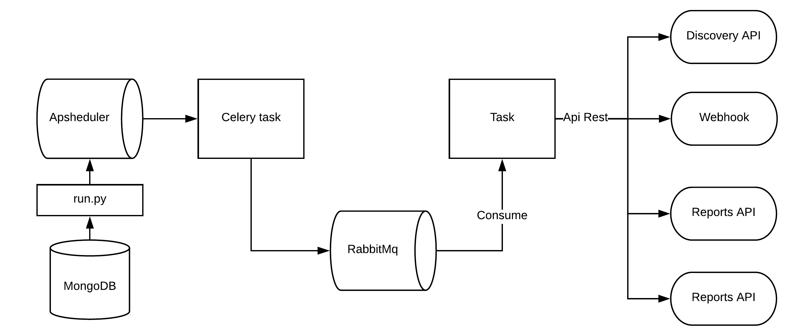

Scheduler App
-------------

Scheduler App is responsable to manage and execute internal jobs.

- Schedule jobs, interval or crontab
- Do chain jobs

----------   

Scheduler use apscheduler to control scheduler jobs, `Apscheduler documentation <https://apscheduler.readthedocs.io/en/latest/>`_

----------    

**Installation with python 3**

    - Python >3.4
    - RabbitMQ
    - MongoDB

Download the repository

.. code-block:: bash

    git clone https://github.com/maestro-server/scheduler-app.git

**Highlights**

- Every 5 seconds the beat gets jobs on ``schedulers collection`` on mongodb.

- Beat can do:

	- **webhook:** Call HTTP request accordly arguments. 

	- **connection:** Sync a cloud data.

    - **report:** Generate/update a report.

- Support tasks.

	- **chain and chain_exec:** If this job have a chain job this tasks will do it.

	- **depleted_job:**  Error handler to get any error and take the job out.

    - **notify_event:** Send a notification. 

----------

**Installation with python 3**

    - Python >3.4
    - RabbitMQ
    - MongoDB

Download the repository

.. code-block:: bash

    git clone https://github.com/maestro-server/scheduler-app.git

----------

**Running scheduler beat**

.. code-block:: bash

    npm run beat

----------

**Running workers**

.. code-block:: bash

    celery -A app.celery worker -E --hostname=scheduler@%h --loglevel=info

    or 

    npm run celery
    