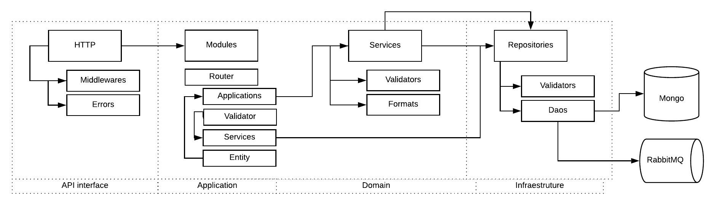

Server App
----------

Server App main application, some responsibility is 

- Authentication and authorization
- Validate and create entities (crud ops)
- Proxy to others services

.. Warning::
	This service can be external access

----------

We using DDD to organize the code, has infra, repositories, entities (values objects), interfaces, application, and domain, if like to learn read this article is very cool `DDD in Node Apps <https://blog.codeminer42.com/nodejs-and-good-practices-354e7d763626>`_ 

Server its have constructed with `KrakenJs <http://krakenjs.com/>`_, we create a lot of middleware and organize by domain.

**Setup dev env**

.. code-block:: bash

    cd devtool/

    docker-compose up -d

Will be setup mongodb and fake smtp server

----------

**Installation with node**

    - Nodejs 8 or above
    - Npm
    - MongoDB
    - Gcc + python (bcrypt package, if need be compilate)

Download de repository

.. code-block:: bash

    git clone https://github.com/maestro-server/server-app.git

----------

**Install  dependences**

.. code-block:: bash

    cd server-app
    npm install

----------

**Configure some env variable**

create .env file

.. code-block:: bash

    SMTP_PORT=1025
    SMTP_HOST=localhost
    SMTP_SENDER='maestro@gmail.com'
    SMTP_IGNORE=true

    MAESTRO_PORT=8888
    MAESTRO_MONGO_URI='localhost'
    MAESTRO_MONGO_DATABASE='maestro-client'

    MAESTRO_DISCOVERY_URI=http://localhost:5000 // list and get status connection
    MAESTRO_REPORT_URI=http://localhost:5005 // create and get reports data
    MAESTRO_ANALYTICS_URI=http://analytics:5020 // create analytics report
    MAESTRO_ANALYTICS_FRONT_URI=http://analytics_front:9999 // get analytics html
    MAESTRO_AUDIT_URI=http://audit:10900 // notify audit update event and get history track

and

.. code-block:: bash

    npm run server

----------

**Multiple env**

Every config can be pass by env variables, but if you like, can be organize by .env files,

=================== ================================
       Name                     Desc                                             
=================== ================================
 .env                Default
 .env.test           Used on run test
 .env.development    node_env is setted development
 .env.production     node_env is setted prodcution
=================== ================================

**Migrate setup data**

create .env file

.. code-block:: bash

    npm run migrate

----------

For production environment, need to use pm2 or forever lib.

Like (PM2):

.. code-block:: bash

    npm install -g pm2

    # Create a file pm2.json

    {
    "apps": [{
        "name": "server-maestro",
        "script": "./server.js",
        "env": {
        "production": true,
        "PORT": 8888
        }
    }]
    }

.. code-block:: bash

    pm2 start --json pm2.json

----------

**Env variables**

=================================== ========================== ============================================ 
            Env Variables                   Example                   Description                          
=================================== ========================== ============================================
 MAESTRO_PORT                        8888                                                                   
 NODE_ENV                            development|production                                                 
 MAESTRO_MONGO_URI                   localhost                  DB string connection
 MAESTRO_MONGO_DATABASE              maestro-client             Database name

 MAESTRO_SECRETJWT                   XXXX                       Secret key - session                                            
 MAESTRO_SECRETJWT_FORGOT            XXXX                       Secret key - forgot request                                            
 MAESTRO_SECRET_CRYPTO_FORGOT        XXXX                       Secret key - forgot content
 MAESTRO_SECRETJWT_PUBLIC            XXX                        Secret key - public shared   
 MAESTRO_SECRETJWT_PRIVATE           XXX                        Secret Key - JWT private connections       
 MAESTRO_NOAUTH                      XXX                        Secret Pass to validate private connections 

 MAESTRO_DISCOVERY_URL               http://localhost:5000      Url discovery-app (flask)                   
 MAESTRO_REPORT_URL                  http://localhost:5005      Url reports-app (flask)
 MAESTRO_ANALYTICS_URI               http://localhost:5020      Url Analytics-app (flask)
 MAESTRO_AUDIT_URI                   http://localhost:10900     Url Audit-app (krakenjs)
 MAESTRO_TIMEOUT                     1000                       Timeout micro service request

 SMTP_PORT                           1025                                                                   
 SMTP_HOST                           localhost                                                              
 SMTP_SENDER                         myemail@XXXX                                                      
 SMTP_IGNORE                         true|false
 SMTP_USETSL                         true|false
 SMTP_USERNAME
 SMTP_PASSWORD

 AWS_ACCESS_KEY_ID                   XXXX                                                                   
 AWS_SECRET_ACCESS_KEY               XXXX                                                                   
 AWS_DEFAULT_REGION                  us-east-1                                                              
 AWS_S3_BUCKET_NAME                  maestroserver              Bucket name                                            
 MAESTRO_UPLOAD_TYPE                 S3 or Local                Upload mode                                 
 LOCAL_DIR                           /public/static/            Where files will be uploaded
 AWS_ENDPOINT                        ny3.spacesdigitalocean     S3 endpoint  
 PWD                                 $rootDirectory             PWD process
=================================== ========================== ============================================
