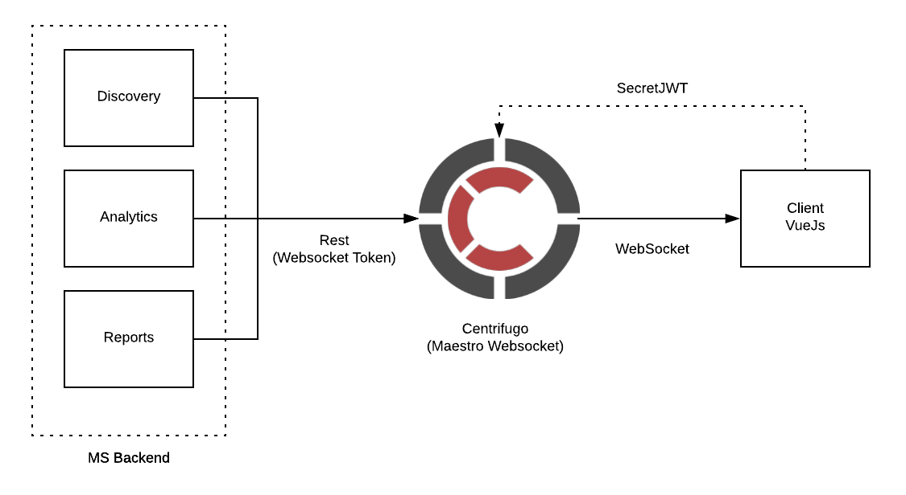

WebSocket APP
---------------

Centrifugo server with rest hooks. It is a websocket + rest server, the websocket is used by client to get a real time notification, and the rest is used by internal maestro do send a notification to the client.

- Client notification using webscokets

Websocket implement a `Centrifugo OpenSource project <https://github.com/centrifugal>`_ (Centrifugo OpenSource project).

---------------

**Setup dev env**

.. code-block:: bash

    # Generate config
    docker run maestro-websocket centrifugo genconfig

    # Run websocket
    docker run -e MAESTRO_WEBSOCKET_SECRET='secret' -e MAESTRO_SECRETJWT='jwttoken' maestroserver/websocket-maestro

    # Run centrifugo with admin enabled
    docker run -e CENTRIFUGO_ADMIN='pass' -e CENTRIFUGO_ADMIN_SECRET='jwttoken' maestroserver/websocket-maestro

----------

Download the repository (Centrifugal project)

.. code-block:: bash

    git clone https://github.com/centrifugal/centrifugo

----------

**Endpoints**

Client access
 
.. code-block:: javascript

    var centrifuge = new Centrifuge('ws://{server}/connection/websocket');

    centrifuge.subscribe("news", function(message) {
        console.log(message);
    });

    centrifuge.connect();

Backend access

.. code-block:: javascript

    import json
    import requests

    command = {
        "method": "publish",
        "params": {
            "channel": "maestro#${ID-USER}", 
            "data": {
                "notify": { // call notify
                    "title": "<string>",
                    "msg": "<string>",
                    "type": "danger|warning|info|success"
                },
                "event": {
                    "caller": "<string>" //custom event on client
                }
            }
        }
    }
