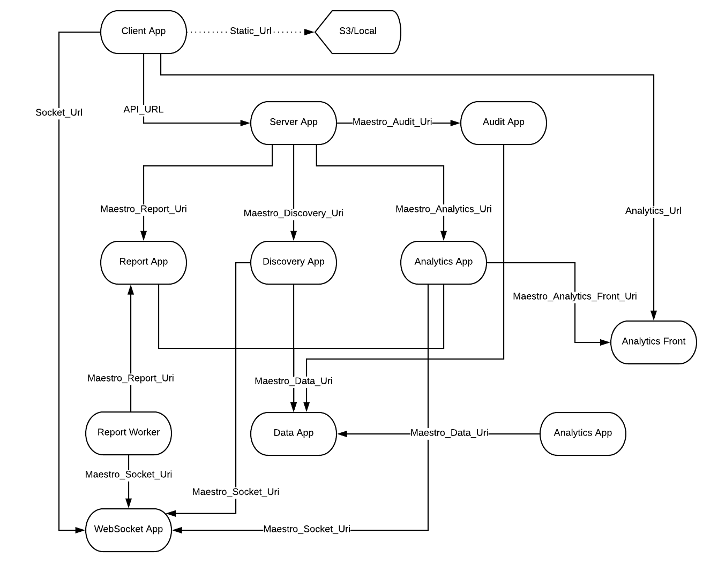

Service Dependecy tree
======================

Architecture map among service dependencies and environment variable used to config this discovery on each service.

------------

+---------------+-----------------+----------------------------------------+-------------+
| Service       | Need to see     | Context                                | Protocol    |
+===============+=================+========================================+=============+
| Client App    | Server App      | SPA application                        | Rest        |
+---------------+-----------------+----------------------------------------+-------------+
|               | WebSocket App   | Received status message (service bus)  | WebSocket   |
+---------------+-----------------+----------------------------------------+-------------+
|               | Analytics Front | Show graphs on bussiness analytics     | Iframe HTTP |
+---------------+-----------------+----------------------------------------+-------------+
| Server App    | Report App      | Create any reports                     | Rest        |
+---------------+-----------------+----------------------------------------+-------------+
|               | Discovery App   | Execute crawler actions                | Rest        |
+---------------+-----------------+----------------------------------------+-------------+
|               | Analytics App   | Create bussiness graphs                | Rest        |
+---------------+-----------------+----------------------------------------+-------------+
|               | Audit App       | Send any update to audit               | Rest        |
+---------------+-----------------+----------------------------------------+-------------+
| Report App    | Data App        | Update report status                   | Rest        |
+---------------+-----------------+----------------------------------------+-------------+
|               | Audit App       | Send any update to audit               | Rest        |
+---------------+-----------------+----------------------------------------+-------------+
|               | WebSocket App   | Send to client any status              | WebSocket   |
+---------------+-----------------+----------------------------------------+-------------+
| Discovery App | Data App        |                                        | Rest        |
+---------------+-----------------+----------------------------------------+-------------+
|               | Audit App       | Send any update to audit               | Rest        |
+---------------+-----------------+----------------------------------------+-------------+
|               | WebSocket App   |                                        | WebSocket   |
+---------------+-----------------+----------------------------------------+-------------+
| Analytics App | Data App        | Populate meta data in analytics entity | Rest        |
+---------------+-----------------+----------------------------------------+-------------+
|               | Analytics Front | Post svgs                              | Rest        |
+---------------+-----------------+----------------------------------------+-------------+
|               | WebSocket App   | Send to client any status              | Socket      |
+---------------+-----------------+----------------------------------------+-------------+
| Scheduler App | Report App      | Automated and manage reports           | Rest        |
+---------------+-----------------+----------------------------------------+-------------+
|               | Discovery App   | Automated and manage discovery         | Rest        |
+---------------+-----------------+----------------------------------------+-------------+
|               | Analytics App   | Automated and manage analçytics        | Rest        |
+---------------+-----------------+----------------------------------------+-------------+
|               | Data App        | Dump connections parameters.           | Rest        |
+---------------+-----------------+----------------------------------------+-------------+
| Audit App     | Data App        | Update any sync rule                   | Rest        |
+---------------+-----------------+----------------------------------------+-------------+