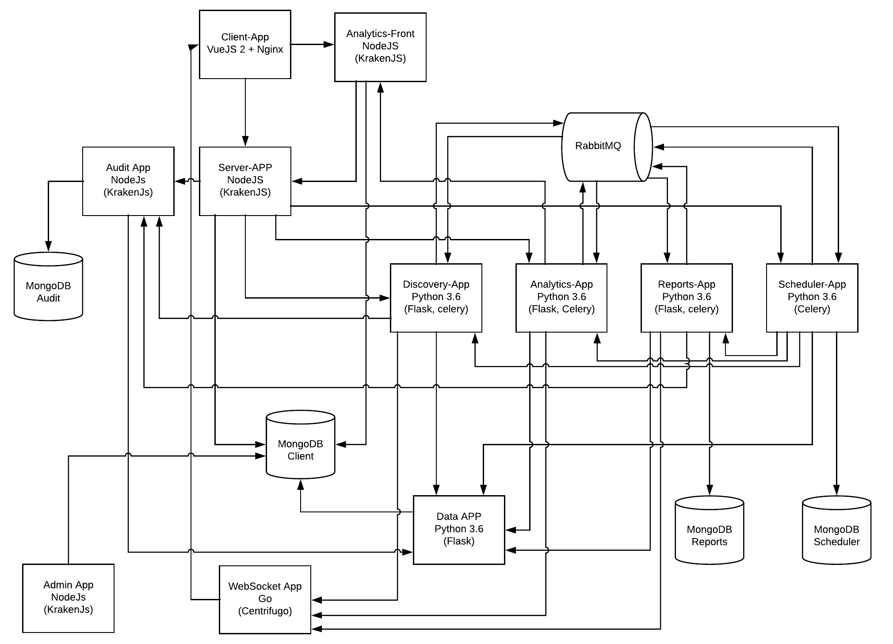

High Architecture
-----------------

-----------------

This section will deep dive over each configuration found it on each Maestro service.

A minimun installation require:

..

    * Client App
    * Server App
    * MongoDB

To uses a synchronous discovery features with AWS and/or other providers, do you need:

..

    * Discovery App
    * Data App
    * RabbitMq

To have an auto update over discovery/reports/analytics api you need to install the scheduler app.

..

    * Scheduler App 

To create and export reports you need to have the reports app installed:

..

    * Reports App
    * Data App
    * RabbitMq

To create a bussiness analytics graphs, public and shared these maps, you need to install these apps:

..

    * Analytics App
    * Analytics Front App
    * Data App
    * RabbitMq

And if you like to tracking history, you should install:

..

    * Audit App

------

Client App
----------

**Installation by docker-compose**

.. code-block:: yaml

    client:
        image: maestroserver/client-maestro
        ports:
        - "80:80"
        environment:
        - "API_URL=http://server-app:8888"
        - "STATIC_URL=http://server-app:8888/static/" # ensure to add slash in the end
        - "ANALYTICS_URL=http://localhost:9999"

.. code-block:: bash

    docker run -p 80:80 
    -e 'API_URL=http://localhost:8888' 
    -e 'STATIC_URL=http://localhost:8888/static/' 
    -e "ANALYTICS_URL=http://localhost:9999" 
    maestroserver/client-maestro

.. Warning::
    * **API_URL:** Set the endpoint provide by ``server-app``.
    * **ANALYTICS_URL:** Set the endpoint provide by ``analytics-front``.
    * **STATIC_URL:** Set the the static url provide by ``server-app``. - `More details on upload setup <http://docs.maestroserver.io/en/latest/installing/upload.html>`_.

**Env variables**

======================= ============================ =============================== 
Env Variables                   Example                    Description         
======================= ============================ =============================== 
API_URL                 http://localhost:8888        Server App Url                                           
STATIC_URL              /static                      Full path static files
ANALYTICS_URL	        http://localhost:9999	     Analytics App Url               
LOGO                    /static/imgs/logo300.png     Logo URL used on login page
THEME                   theme-lotus                  Theme (gold|wine|blue|green|dark)
======================= ============================ =============================== 

----------

Server APP
----------

**Installation by docker**

.. code-block:: yaml

    server:
        image: maestroserver/server-maestro
        ports:
        - "8888:8888"
        environment:
        - "MAESTRO_MONGO_URI=mongodb://mongodb"
        - "MAESTRO_MONGO_DATABASE=maestro-client"
        - "MAESTRO_DISCOVERY_URI=http://discovery:5000"
        - "MAESTRO_ANALYTICS_URI=http://analytics:5020"
        - "MAESTRO_REPORT_URI=http://reports:5005"
        - "MAESTRO_AUDIT_URI=http://audit:10900"

.. code-block:: bash

    docker run -p 8888:8888  
        -e "MAESTRO_MONGO_URI=mongodb://mongodb" 
        -e "MAESTRO_MONGO_DATABASE=maestro-client" 
        -e "MAESTRO_DISCOVERY_URI=http://localhost:5000" 
        -e "MAESTRO_REPORT_URI=http://localhost:5005"
        -e "MAESTRO_ANALYTICS_URI=http://localhost:5020"
        -e "MAESTRO_AUDIT_URI=http://audit:10900"
        maestroserver/server-maestro 

.. Warning::
    * **MAESTRO_MONGO_URI:** - It must be the full url -``mongodb://{MAESTRO_MONGO_URI}/{MAESTRO_MONGO_DATABASE}``
    * **MAESTRO_MONGO_DATABASE:** - The mongodb database name (ex: maestro-client)
    * **SMTP_X:** - It used to send transactional emails - `More details about SMTP <http://docs.maestroserver.io/en/latest/installing/smtp.html>`_. 
    * **MAESTRO_UPLOAD_TYPE:** - Can be a local or S3 - `More details about upload <http://docs.maestroserver.io/en/latest/installing/upload.html>`_.
    * **MAESTRO_SECRETJWT_PUBLIC:** - Hash used only do public shared resources, must be different of ``MAESTRO_SECRETJWT`` - `More details about tokens <http://docs.maestroserver.io/en/latest/installing/tokens.html>`_.

**Env variables**

=================================== ========================== ============================================ 
            Env Variables                   Example                   Description                          
=================================== ========================== ============================================
 MAESTRO_PORT                        8888                                                                   
 NODE_ENV                            development|production                                                 
 MAESTRO_MONGO_URI                   mongodb://localhost        DB string connection
 MAESTRO_MONGO_DATABASE              maestro-client             Database name

 MAESTRO_SECRETJWT                   XXXX                       Secret key - session                                            
 MAESTRO_SECRETJWT_FORGOT            XXXX                       Secret key - forgot request                                            
 MAESTRO_SECRET_CRYPTO_FORGOT        XXXX                       Secret key - forgot content
 MAESTRO_SECRETJWT_PUBLIC            XXX                        Secret key - public shared   
 MAESTRO_SECRETJWT_PRIVATE           XXX                        Secret Key - JWT private connections       
 MAESTRO_NOAUTH                      XXX                        Secret Pass to validate private connections 

 MAESTRO_DISCOVERY_URL               http://localhost:5000      Url discovery-app (flask)                   
 MAESTRO_REPORT_URL                  http://localhost:5005      Url reports-app (flask)
 MAESTRO_ANALYTICS_URI               http://localhost:5020      Url Analytics-app (flask)
 MAESTRO_AUDIT_URI                   http://localhost:10900     Url Audit-app (krakenjs)
 MAESTRO_TIMEOUT                     1000                       Timeout micro service request

 SMTP_PORT                           1025                                                                   
 SMTP_HOST                           localhost                                                              
 SMTP_SENDER                         myemail@XXXX                                                      
 SMTP_IGNORE                         true|false
 SMTP_USETSL                         true|false
 SMTP_USERNAME
 SMTP_PASSWORD

 AWS_ACCESS_KEY_ID                   XXXX                                                                   
 AWS_SECRET_ACCESS_KEY               XXXX                                                                   
 AWS_DEFAULT_REGION                  us-east-1                                                              
 AWS_S3_BUCKET_NAME                  maestroserver              Bucket name                                            
 MAESTRO_UPLOAD_TYPE                 S3 or Local                Upload mode                                 
 LOCAL_DIR                           /public/static/            Where files will be uploaded
 MAESTRO_TMP                         $rootDirectory             Tmp folder used on upload files process

 MAESTRO_AUDIT_DISABLED              false                      Disable the audit services
 MAESTRO_REPORT_DISABLED             false                      Disable the report services
 MAESTRO_DISCOVERY_DISABLED          false                      Disable the discovery service
=================================== ========================== ============================================

Discovery App
-------------

**Installation by docker**

.. code-block:: yaml

    discovery:
        image: maestroserver/discovery-maestro
        ports:
        - "5000:5000"
        environment:
        - "CELERY_BROKER_URL=amqp://rabbitmq:5672"
        - "MAESTRO_DATA_URI=http://data:5010"

    discovery_worker:
        image: maestroserver/discovery-maestro-celery
        environment:
        - "CELERY_BROKER_URL=amqp://rabbitmq:5672"
        - "MAESTRO_DATA_URI=http://data:5010"
        - "MAESTRO_AUDIT_URI=http://audit:10900"

.. code-block:: bash

    docker run -p 5000:5000  -e "MAESTRO_DATA_URI=http://localhost:5010" -e "CELERY_BROKER_URL=amqp://rabbitmq:5672" maestroserver/discovery-maestro 
 
    docker run \
        -e "MAESTRO_DATA_URI=http://localhost:5010" \
        -e "CELERY_BROKER_URL=amqp://rabbitmq:5672" \
        -e "MAESTRO_AUDIT_URI=http://localhost:10900" \
        maestroserver/discovery-maestro-celery 

.. Warning::
    * **MAESTRO_DATA_URI:** - Data App enpoint API - default port is 5000
    * **MAESTRO_AUDIT_URI:** - Audit App endpoint API - default port is 10900
    * **MAESTRO_WEBSOCKET_URI:** - Websocket endpoint, this one is HTTP

**Env variables**

========================== ============================ ==============================================
Env Variables                   Example                    Description         
========================== ============================ ==============================================  
MAESTRO_PORT			   5000  					     Port used    
MAESTRO_DATA_URI           http://localhost:5010         Data Layer API URL
MAESTRO_AUDIT_URI	       http://localhost:10900	     Audit App - API URL
MAESTRO_WEBSOCKET_URI	   http://localhost:8000	     Webosocket App - API URL

MAESTRO_SECRETJWT          XXX                           Same that Server App
MAESTRO_SECRETJWT_PRIVATE  XXX                           Secret Key - JWT private connections       
MAESTRO_NOAUTH             XXX                           Secret Pass to validate private connections 
MAESTRO_WEBSOCKET_SECRET   XXX                           Secret Key - JWT Websocket connections

MAESTRO_TRANSLATE_QTD      200                           Prefetch translation process
MAESTRO_GWORKERS           2                             Gunicorn multi process
CELERY_BROKER_URL          amqp://rabbitmq:5672          RabbitMQ connection
CELERYD_TASK_TIME_LIMIT    10                            Timeout workers
========================== ============================ ==============================================

Reports App
-----------

**Installation by docker**

.. code-block:: yaml

    reports:
        image: maestroserver/reports-maestro
        ports:
        - "5005:5005"
        environment:
        - "CELERY_BROKER_URL=amqp://rabbitmq:5672"
        - "MAESTRO_MONGO_URI=mongodb://mongodb"
        - "MAESTRO_MONGO_DATABASE=maestro-reports"

    reports_worker:
        image: maestroserver/reports-maestro-celery
        environment:
        - "MAESTRO_REPORT_URI=http://reports:5005"
        - "MAESTRO_DATA_URI=http://data:5010"
        - "MAESTRO_AUDIT_URI=http://audit:10900"
        - "CELERY_BROKER_URL=amqp://rabbitmq:5672"

.. Warning::
    * **MAESTRO_REPORT_URI:** - Reports enpoint API - default port is 5005, It used by reports workers
    * **MAESTRO_DATA_URI:** - Data enpoint API - default port is 5000
    * **MAESTRO_AUDIT_URI:** - Audit Endpoint API - default port is 10900
    * **MAESTRO_WEBSOCKET_URI:** - Websocket endpoint, this one is HTTP

.. code-block:: bash

    docker run -p 5005 -e "MAESTRO_DATA_URI=http://localhost:5010" -e "CELERY_BROKER_URL=amqp://rabbitmq:5672" -e 'MAESTRO_MONGO_URI=localhost' maestroserver/reports-maestro
 
    docker run \
        -e "MAESTRO_DATA_URI=http://localhost:5010" \
        -e "MAESTRO_REPORT_URI=http://localhost:5005" \
        -e "CELERY_BROKER_URL=amqp://rabbitmq:5672" \
        -e "MAESTRO_AUDIT_URI=http://audit:10900" \
        maestroserver/reports-maestro-celery 
     
    
**Env variables**

========================= ============================ ===========================================
Env Variables                   Example                    Description         
========================= ============================ ===========================================
MAESTRO_PORT			  5005						   Port used 
MAESTRO_MONGO_URI         localhost                    Mongo Url conn
MAESTRO_MONGO_DATABASE    maestro-reports              Db name, its differente of servers-app     

MAESTRO_DATA_URI          http://localhost:5010        Data layer api
MAESTRO_REPORT_URI        http://localhost:5005        Report api
MAESTRO_AUDIT_URI	      http://localhost:10900	   Audit App - API URL
MAESTRO_WEBSOCKET_URI	  http://localhost:8000	       Webosocket App - API URL

MAESTRO_SECRETJWT_PRIVATE XXX                          Secret Key - JWT private connections       
MAESTRO_NOAUTH            XXX                          Secret Pass to validate private connections 
MAESTRO_WEBSOCKET_SECRET  XXX                          Secret Key - JWT Websocket connections

MAESTRO_REPORT_RESULT_QTD 1500                         Limit default
MAESTRO_INSERT_QTD        20                           Prefetch data insert

MAESTRO_GWORKERS          2                            Gworkers thread pool                         
CELERY_BROKER_URL         amqp://rabbitmq:5672         RabbitMQ connection
========================= ============================ ===========================================

Analytics App
-------------

**Installation by docker**

.. code-block:: yaml

    analytics:
        image: maestroserver/analytics-maestro
        ports:
        - "5020:5020"
        environment:
        - "CELERY_BROKER_URL=amqp://rabbitmq:5672"
        - "MAESTRO_DATA_URI=http://data:5010"

    analytics_worker:
        image: maestroserver/analytics-maestro-celery
        environment:
        - "MAESTRO_DATA_URI=http://data:5010"
        - "MAESTRO_ANALYTICS_FRONT_URI=http://analytics_front:9999"
        - "CELERY_BROKER_URL=amqp://rabbitmq:5672" 
        - "CELERYD_MAX_TASKS_PER_CHILD=2"

.. Warning::
    * **MAESTRO_ANALYTICS_FRONT_URI:** - Analytics Front enpoint API - default port is 9999
    * **MAESTRO_DATA_URI:** - Data enpoint API - default port is 5000
    * **MAESTRO_WEBSOCKET_URI:** - Websocket endpoint, this one is HTTP

.. code-block:: bash

    docker run -p 5020 
        -e "MAESTRO_DATA_URI=http://localhost:5010" 
        -e "CELERY_BROKER_URL=amqp://rabbitmq:5672" 
        -e 'MAESTRO_MONGO_URI=localhost' 
        maestroserver/analytics-maestro
 
    docker run 
        -e "MAESTRO_DATA_URI=http://localhost:5010"
        -e "MAESTRO_ANALYTICS_FRONT_URI=http://localhost:9999"
        -e "CELERY_BROKER_URL=amqp://rabbitmq:5672" 
        maestroserver/analytics-maestro-celery 
     
    
**Env variables**

=========================== ============================ =============================================
Env Variables                   Example                    Description         
=========================== ============================ =============================================    
MAESTRO_PORT                 5020                         Port
MAESTRO_DATA_URI             http://localhost:5010        Data Layer API URL
MAESTRO_ANALYTICS_FRONT_URI  http://localhost:9999        Analytics Front URL
MAESTRO_WEBSOCKET_URI	     http://localhost:8000	      Webosocket App - API URL

MAESTRO_SECRETJWT_PRIVATE    XXX                          Secret Key - JWT private connections       
MAESTRO_NOAUTH               XXX                          Secret Pass to validate private connections 
MAESTRO_WEBSOCKET_SECRET     XXX                          Secret Key - JWT Websocket connections

MAESTRO_GWORKERS             2                            Gunicorn multi process
CELERY_BROKER_URL            amqp://rabbitmq:5672         RabbitMQ connection
CELERYD_TASK_TIME_LIMIT      10                           Timeout workers
=========================== ============================ =============================================

Analytics Front
---------------

**Installation by docker**

.. code-block:: yaml

    reports:
        image: maestroserver/analytics-front-maestro
        ports:
        - "9999:9999"
        environment:
        - "MAESTRO_MONGO_URI=mongodb://mongodb"
        - "MAESTRO_MONGO_DATABASE=maestro-client"

.. Warning::
    * **MAESTRO_REPORT_URI:** - Reports enpoint API - default port is 5005
    * **MAESTRO_DATA_URI:** - Data enpoint API - default port is 5000
    * **MAESTRO_WEBSOCKET_URI:** - Websocket endpoint, this one is HTTP

.. code-block:: bash

    docker run -p 5005 
        -e "MAESTRO_MONGO_URI=mongodb://mongodb"
        -e "MAESTRO_MONGO_DATABASE=maestro-client"
        maestroserver/analytics-front-maestro
 

**Env variables**

================================== ========================== ============================================== 
            Env Variables                   Example                   Description                          
================================== ========================== ==============================================
MAESTRO_PORT                        9999                                                   
API_URL                             http://localhost:8888      Server app Url               
NODE_ENV                            development|production                                 
MAESTRO_MONGO_URI                   localhost                  DB string connection         
MAESTRO_MONGO_DATABASE              maestro-client             Database name   

MAESTRO_SECRETJWT                   XXXX                       Secret key - server app         
MAESTRO_SECRETJWT_PRIVATE           XXX                        Secret Key - JWT private connections       
MAESTRO_NOAUTH                      XXX                        Secret Pass to validate private connections
MAESTRO_SECRETJWT_PUBLIC	        XXXX	                   Secret key - same as on server app 

AWS_ACCESS_KEY_ID                   XXXX                                                   
AWS_SECRET_ACCESS_KEY               XXXX                                                   
AWS_DEFAULT_REGION                  us-east-1                                              
AWS_S3_BUCKET_NAME                  maestroserver                                          
MAESTRO_UPLOAD_TYPE                 S3/Local                   Upload mode                  
LOCAL_DIR                           /public/static/            Where files will be uploaded 
PWD                                 $rootDirectory             PWD process                  
================================== ========================== ==============================================

Data App
--------

**Installation by docker**

.. code-block:: yaml

    data:
        image: maestroserver/data-maestro
        ports:
        - "5010:5010"
        environment:
            - "MAESTRO_MONGO_URI=mongodb://mongodb"
            - "MAESTRO_MONGO_DATABASE=maestro-client"

.. code-block:: bash

    docker run -p 5010 -e "MAESTRO_MONGO_URI=mongodb://mongodb" -e "MAESTRO_MONGO_DATABASE=maestro-client" maestroserver/data-maestro

**Env variables**

========================= ============================ =============================================
Env Variables                   Example                    Description         
========================= ============================ =============================================
MAESTRO_PORT			  5010						    Port used 
MAESTRO_MONGO_URI         localhost                     Mongo Url conn
MAESTRO_MONGO_DATABASE    maestro-client                Db name, its differente of servers-app     
MAESTRO_GWORKERS   		  2       					    Gunicorn multi process  
MAESTRO_INSERT_QTD        200                           Throughput insert used on reports collection
MAESTRO_SECRETJWT_PRIVATE XXX                           Secret Key - JWT private connections       
MAESTRO_NOAUTH            XXX                           Secret Pass to validate private connections
========================= ============================ =============================================

Scheduler App
-------------

**Installation by docker**

.. code-block:: yaml

    scheduler:
        image: maestroserver/scheduler-maestro
        environment:
        - "MAESTRO_DATA_URI=http://data:5010"
        - "CELERY_BROKER_URL=amqp://rabbitmq:5672"
        - "MAESTRO_MONGO_URI=mongodb://mongodb"
        - "MAESTRO_MONGO_DATABASE=maestro-client"

    scheduler_worker:
        image: maestroserver/scheduler-maestro-celery
        environment:
        - "MAESTRO_DATA_URI=http://data:5010"
        - "CELERY_BROKER_URL=amqp://rabbitmq:5672"
        - "MAESTRO_DISCOVERY_URI=http://discovery:5000"
        - "MAESTRO_ANALYTICS_URI=http://analytics:5020"
        - "MAESTRO_REPORT_URI=http://reports:5005"

.. code-block:: bash

    docker run 
        -e "MAESTRO_DATA_URI=http://localhost:5010" 
        -e "CELERY_BROKER_URL=amqp://rabbitmq:5672" 
        maestroserver/scheduler-maestro
 
    docker run 
        -e "MAESTRO_DATA_URI=http://localhost:5010"
        -e "MAESTRO_DISCOVERY_URI=http://localhost:5000"
        -e "MAESTRO_ANALYTICS_URI=http://localhost:5020"
        -e "MAESTRO_REPORT_URI=http://localhost:5005"
        -e "CELERY_BROKER_URL=amqp://rabbitmq:5672" 
        maestroserver/scheduler-maestro-celery 
     
.. Warning::
    * **MAESTRO_DATA_URI:** - Data API - default port is 5000

.. Danger::
    * You can only spin up an one schedule instance, if you do it will have a duplicate job execution.

**Env variables**

============================ ============================ ============================================= 
Env Variables                   Example                    Description         
============================ ============================ ============================================= 
MAESTRO_DATA_URI              http://localhost:5010        Data Layer API URL
MAESTRO_DISCOVERY_URI         http://localhost:5000        Discovery App URL
MAESTRO_ANALYTICS_URI         http://localhost:5020        Analytics App URL
MAESTRO_REPORT_URI            http://localhost:5005        Reports App URL

MAESTRO_MONGO_URI             localhost                    MongoDB URI
MAESTRO_MONGO_DATABASE        maestro-client               Mongo Database name
CELERY_BROKER_URL             amqp://rabbitmq:5672         RabbitMQ connection

MAESTRO_SECRETJWT_PRIVATE     XXX                          Secret Key - JWT private connections       
MAESTRO_NOAUTH                XXX                          Secret Pass to validate private connections
============================ ============================ =============================================

Audit App
---------

**Installation by docker**

.. code-block:: yaml

    audit:
        image: maestroserver/audit-app-maestro
        ports:
        - "10900:10900"
        environment:
        - "MAESTRO_MONGO_URI=mongodb://mongodb"
        - "MAESTRO_MONGO_DATABASE=maestro-audit"
        - "MAESTRO_DATA_URI=http://data:5010"

.. Warning::
    * **MAESTRO_DATA_URI:** - Data API - default port is 5000

.. code-block:: bash

    docker run -p 10900 
        -e "MAESTRO_MONGO_URI=mongodb://mongodb"
        -e "MAESTRO_MONGO_DATABASE=maestro-audit"
        maestroserver/audit-app-maestro
 

**Env variables**

================================== ========================== ============================================
            Env Variables                   Example                   Description                          
================================== ========================== ============================================
MAESTRO_PORT                         10900                                                               
NODE_ENV                             development|production                                              
MAESTRO_MONGO_URI                    localhost                DB string connection 

MAESTRO_MONGO_DATABASE               maestro-audit            Database name                              
MAESTRO_TIMEOUT                      1000                     Timeout any http private request           
MAESTRO_DATA_URI                     http://localhost:5010    Data App - API URL 

MAESTRO_SECRETJWT_PRIVATE            XXX                      Secret Key - JWT private connections       
MAESTRO_NOAUTH                       XXX                      Secret Pass to validate private connections               
================================== ========================== ============================================

WebSocket App
-------------

**Installation by docker**

.. code-block:: yaml

    data:
        image: maestroserver/websocket-maestro
        ports:
        - "8000:8000"

.. code-block:: bash

    docker run -p 8000:800 maestroserver/websocket-maestro

**Env variables**

========================= ============================ ======================================================================================
Env Variables                   Example                    Description         
========================= ============================ ======================================================================================
MAESTRO_WEBSOCKET_SECRET  backSecretToken	           Token to authenticate backends apps
MAESTRO_SECRETJWT	      frontSecretToken	           Token to autheticate front end users
CENTRIFUGO_ADMIN	      adminPassword	               Admin password
CENTRIFUGO_ADMIN_SECRET	  adminSecretToken	           Token to autheticate administrator users
CENTRIFUGO_TLSAUTO	      true	                       Auto SSL using Let Encrypt
CENTRIFUGO_TLSAUTO_HTTP	  true	                       Auto SSL using AcmeV1 Let Encrypt
CENTRIFUGO_TLS_PORT	      :80	                       Can be used to set address for handling http_01 ACME challenge, default value is :80
CENTRIFUGO_TLS	          true	                       Using dev ssl certs to run custom certs
CENTRIFUGO_TLS_KEY	      /tmp/certs/server.key	       Full path ssl key (Expose by folder bind on docker)
CENTRIFUGO_TLS_CERT	      /tmp/certs/server.key	       Full path ssl certs
========================= ============================ ======================================================================================