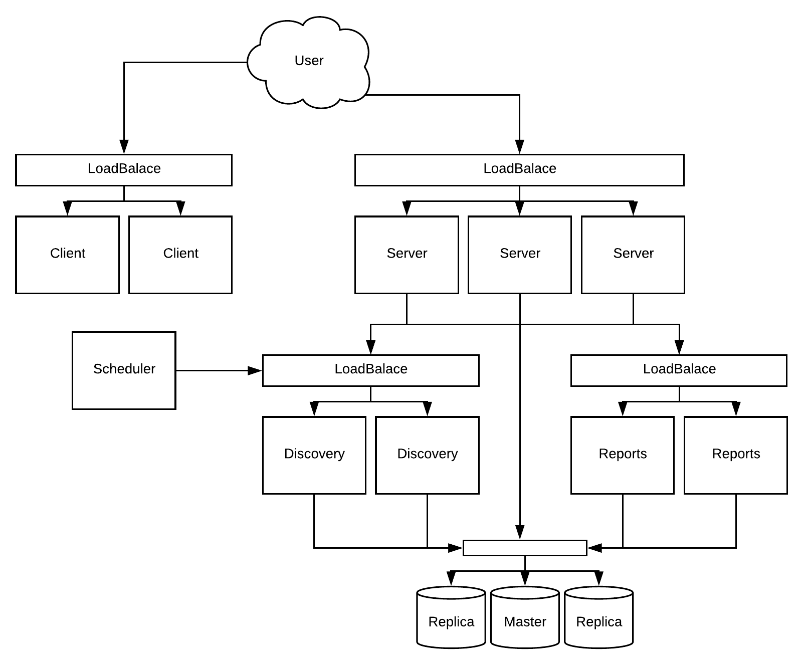
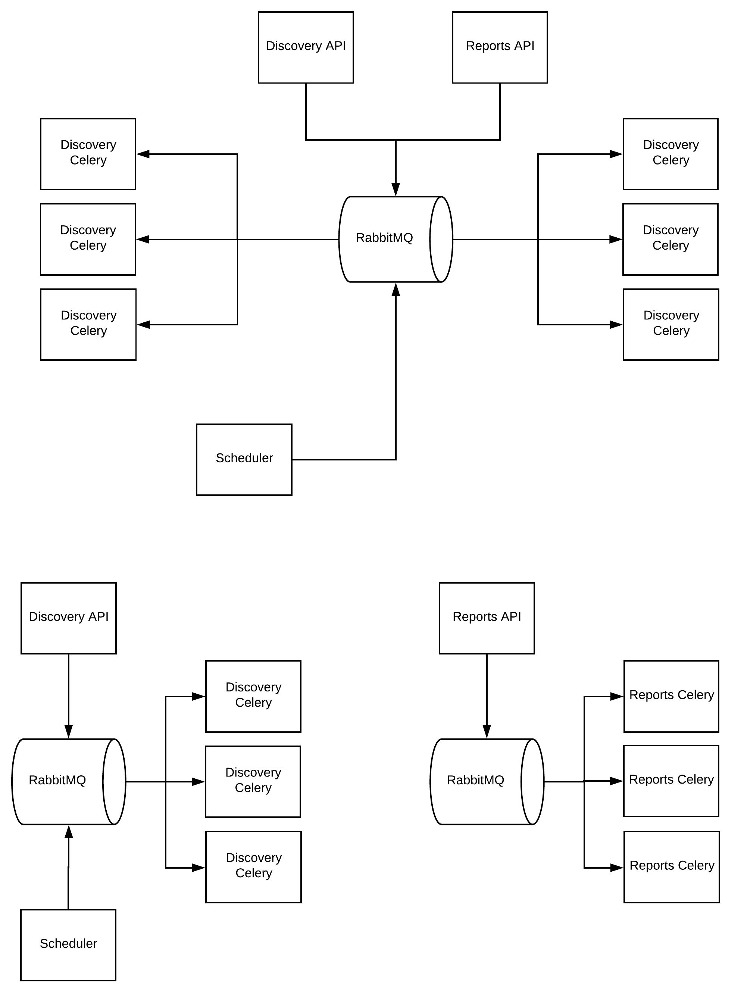

12 Factory and Horizontal Scaling
---------------------------------

This section describes some tips you can use to be able to productionize the Maestro.

- The first and most important is to avoid to use any local configuration as a local upload file system, local mongodb and rabbitmq.

	- You should use a reliable storage engine as S3 - `More details about upload <http://docs.maestroserver.io/en/latest/installing/upload.html>`_.
	- You can use atlas mongodb to manage your mongo db externally. - `More details about external DB <http://docs.maestroserver.io/en/latest/installing/external_db.html>`_.
	- Configurate a third-party SMTP - `More details about SMTP <http://docs.maestroserver.io/en/latest/installing/smtp.html>`_. 
	- Set a unique value for each ``SECRETJWT`` key - `More details about tokens <http://docs.maestroserver.io/en/latest/installing/tokens.html>`_.

- Spin up an nginx/loadbalance over any public endpoint to handle ssl configuration.

- Discovery, reports and analytics services are compound by two parts, one it's the api, and the other is the workers, you don't need to deploy it on the same server.

Follow a single example,

----------

It's possible to improve the reliability over discovery and reports services.

----------

Scheduler Beat App
------------------

.. Danger::
	Scheduler app have two parts, the producer called beat and the workers, the beat isn't able to have multiple instance on the same time, be carefull. To minimize the drawback, the beat schedule is an isolated and an stateless service (if fall, you can call up the beat again). 
     