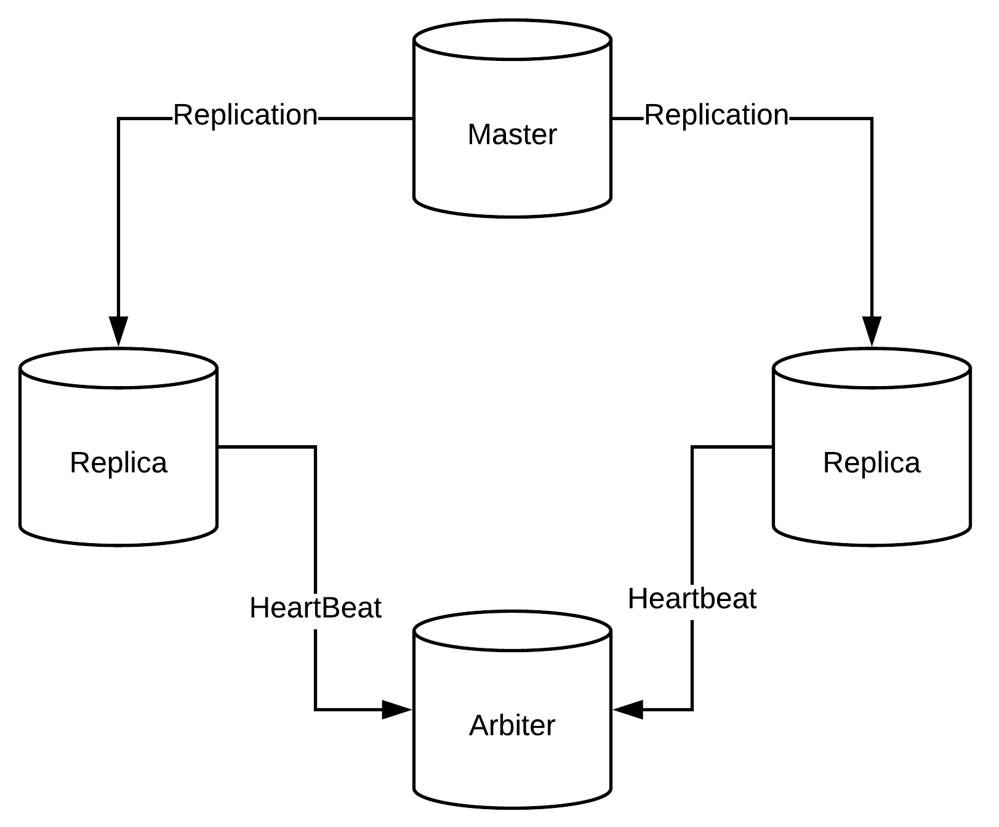

====================
HA - Production Read
====================

Not exist one way to do right, but we have some concerns, needed a backup system, HA avaliability, monitoring and etc, like a normal app system. Maestro built with 12 factory in mind, its able to hight availability and horizontal scaling.

12 Factory and Horizontal Scaling
---------------------------------

All services need work in stateless, like session, images or any process, we use JWT for authentication and isolated storage server.

- Avoid to use any local configurate like local upload, maestro has supported to use s3 storage object.

- Put all connection config in env docker setup, would able to use kubernetes, rancher or any orchestration is good advice.

- Its possible to deploy discovery api in one server, and discovery celery another server.

- In front end, use nginx, or any other proxy.

One example setup, can be in each node,

.. image:: ../_static/screen/ha.png

----------

It's possible to improve discovery and reports app

.. image:: ../_static/screen/discovery_reports.png

----------

MongoDB
-------

MongoDB is prepared to scale and high availability, the best setup creates a master and `replica <https://docs.mongodb.com/manual/tutorial/deploy-replica-set>`_,

Version
-------

We controlled a version (semversion), any docker has this version, for example, maestro-server:0.3, if you need to rollback is easier to do.
How find my version:

- Front end, show in right-footer.

- http://server.api.maestroserver.io:8888/

- http://discovery.api.maestroserver.io:5000/

- http://reports.api.maestroserver.io:5005/

Health Check
------------

- **http://server.api.maestroserver.io:8888/health** - Check mongoDB connection.

- **http://discovery.api.maestroserver.io:5000/health** - Check RabbitMQ and MongoDB Connection

- **http://reports.api.maestroserver.io:5005/health** - Check RabbitMQ and MongoDB Connection
