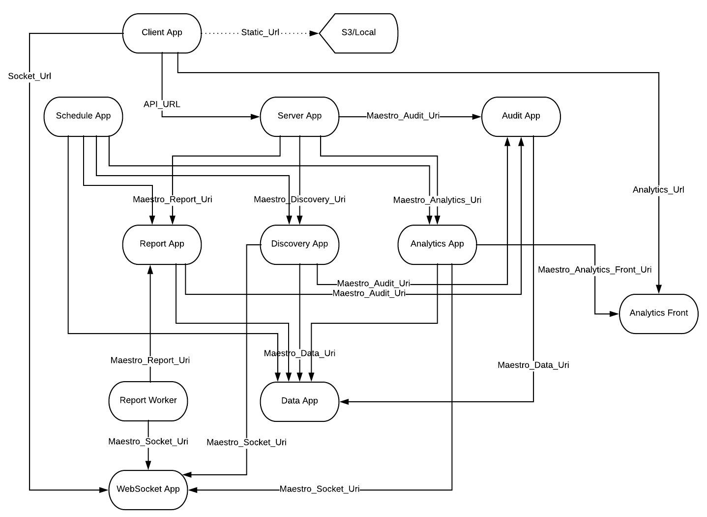

Service Discovery Configuration
===============================

This section describes the service discovery configuration. The Maestro server uses env vars to set the configuration between applications, as an example the server-app uses the ``MAESTRO_DISCOVERY_URI`` to figure out where the discovery app is.

------------

+---------------+-----------------+----------------------------+----------------------------------------+-------------+
| Service       | To discovery    |                            | Context                                | Protocol    |
+===============+=================+============================+========================================+=============+
| Client App    | Server App      | API_URL                    | SPA application                        | Rest        |
+---------------+-----------------+----------------------------+----------------------------------------+-------------+
|               | WebSocket App   | WEBSOCKET_URL              | Received status message (service bus)  | WebSocket   |
+---------------+-----------------+----------------------------+----------------------------------------+-------------+
|               | Analytics Front | ANALYTICS_URL              | Show graphs on business analytics      | Iframe HTTP |
+---------------+-----------------+----------------------------+----------------------------------------+-------------+
| Server App    | Report App      | MAESTRO_REPORT_URI         | Create any reports                     | Rest        |
+---------------+-----------------+----------------------------+----------------------------------------+-------------+
|               | Discovery App   | MAESTRO_DISCOVERY_URI      | Execute crawler actions                | Rest        |
+---------------+-----------------+----------------------------+----------------------------------------+-------------+
|               | Analytics App   | MAESTRO_ANALITYCS_URI      | Create business graphs                 | Rest        |
+---------------+-----------------+----------------------------+----------------------------------------+-------------+
|               | Audit App       | MAESTRO_AUDIT_URI          | Send any update to audit               | Rest        |
+---------------+-----------------+----------------------------+----------------------------------------+-------------+
| Report App    | Data App        | MAESTRO_DATA_URI           | Update report status                   | Rest        |
+---------------+-----------------+----------------------------+----------------------------------------+-------------+
|               | Audit App       | MAESTRO_AUDIT_URI          | Send any update to audit               | Rest        |
+---------------+-----------------+----------------------------+----------------------------------------+-------------+
|               | WebSocket App   | MAESTRO_WEBSOCKET_URI      | Send to client any status              | WebSocket   |
+---------------+-----------------+----------------------------+----------------------------------------+-------------+
| Discovery App | Data App        | MAESTRO_DATA_URI           |                                        | Rest        |
+---------------+-----------------+----------------------------+----------------------------------------+-------------+
|               | Audit App       | MAESTRO_AUDIT_URI          | Send any update to audit               | Rest        |
+---------------+-----------------+----------------------------+----------------------------------------+-------------+
|               | WebSocket App   | MAESTRO_WEBSOCKET_URI      |                                        | WebSocket   |
+---------------+-----------------+----------------------------+----------------------------------------+-------------+
| Analytics App | Data App        | MAESTRO_DATA_URI           | Populate meta data in analytics entity | Rest        |
+---------------+-----------------+----------------------------+----------------------------------------+-------------+
|               | Analytics Front | MAESTRO_ANALYTICS_FRONT_URI| Post svgs                              | Rest        |
+---------------+-----------------+----------------------------+----------------------------------------+-------------+
|               | WebSocket App   | MAESTRO_WEBSOCKET_URI      | Send to client any status              | Socket      |
+---------------+-----------------+----------------------------+----------------------------------------+-------------+
| Scheduler App | Report App      | MAESTRO_REPORT_URI         | Automated and manage reports           | Rest        |
+---------------+-----------------+----------------------------+----------------------------------------+-------------+
|               | Discovery App   | MAESTRO_DISCOVERY_URI      | Automated and manage discovery         | Rest        |
+---------------+-----------------+----------------------------+----------------------------------------+-------------+
|               | Analytics App   | MAESTRO_ANALITYCS_URI      | Automated and manage analçytics        | Rest        |
+---------------+-----------------+----------------------------+----------------------------------------+-------------+
|               | Data App        | MAESTRO_DATA_URI           | Dump connections parameters.           | Rest        |
+---------------+-----------------+----------------------------+----------------------------------------+-------------+
| Audit App     | Data App        | MAESTRO_DATA_URI           | Update any sync rule                   | Rest        |
+---------------+-----------------+----------------------------+----------------------------------------+-------------+
