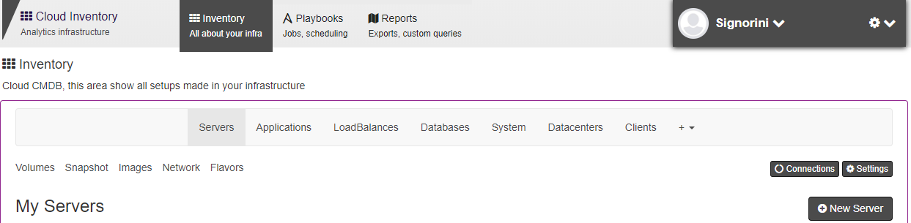
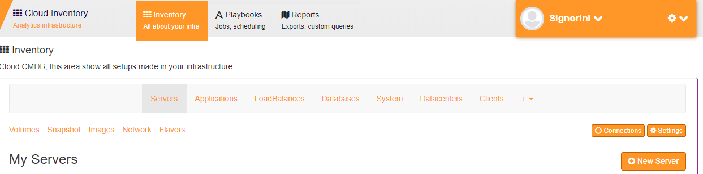

Themes
======

You can change the maestro theme, its a variable environment into client app

.. code-block:: yaml

    client:
        image: maestroserver/client-maestro
        ports:
        - "80:80"
        environment:
        - "API_URL=http://localhost:8888"
        - "THEME=gold"

There are fill options to choose.

Default
-------

.. figure:: ../_static/screen/theme_default.png

    THEME=lotus

Gold
-------

    THEME=gold

Wine
-------

.. figure:: ../_static/screen/theme_wine.png

    THEME=wine

Blue
-------

.. figure:: ../_static/screen/theme_blue.png

    THEME=blue

Dark
-------

    THEME=dark

Green
-------

.. figure:: ../_static/screen/theme_green.png

    THEME=green

Orange
-------

    THEME=orange

