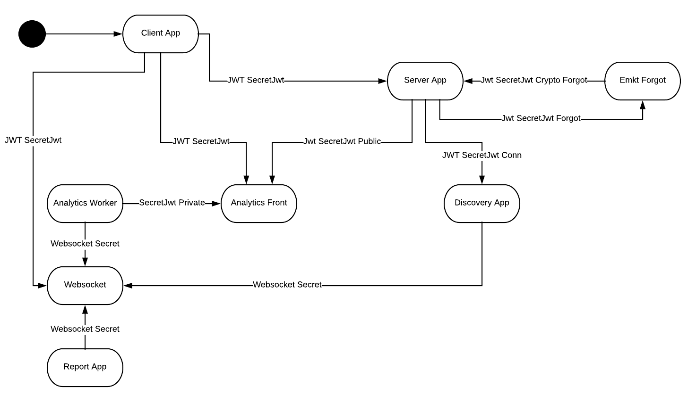

JWT Tokens
==========

Maestro uses JWT token to handle the authentication/authorization task, those tasks are:

- Authenticate users
- Authenticate private requests between the services
- Authenticate public requests as websockets

High level architecture:

------------

+----------------------------+--------------------------------------------+------------------------+-----------------+----------------------------------------------------------+
| JWT Name                   | Context                                    | Owned by               | Used by         |                                                          |
+============================+============================================+========================+=================+==========================================================+
| SecreteJwt                 | Authenticate/Authorization users           | Server App             | Client App      | Jwt user auth                                            |
+----------------------------+--------------------------------------------+------------------------+-----------------+----------------------------------------------------------+
|                            |                                            |                        | Discovery App   | To crawler 3 party provider                              |
+----------------------------+--------------------------------------------+------------------------+-----------------+----------------------------------------------------------+
|                            |                                            |                        | Analytics Front | Jwt user auth                                            |
+----------------------------+--------------------------------------------+------------------------+-----------------+----------------------------------------------------------+
|                            |                                            |                        | WebSocket       | To authorize to connect on websocket                     |
+----------------------------+--------------------------------------------+------------------------+-----------------+----------------------------------------------------------+
| SecretJwt Public           | Auth shared links (public access)          | Server App             | Analytics Front | Used to authorize to access a public graphs              |
+----------------------------+--------------------------------------------+------------------------+-----------------+----------------------------------------------------------+
| SecretJwt Crpto Forgot     | First secret key, request forgot password  | Server App             | Client App      |                                                          |
+----------------------------+--------------------------------------------+------------------------+-----------------+----------------------------------------------------------+
| SecretJwt Forgot           | Second secret key, confirm forgot password | Server App             | Server App      |                                                          |
+----------------------------+--------------------------------------------+------------------------+-----------------+----------------------------------------------------------+
| SecretJwt Socket           | Authorization users to connect to websocket| Websocket App          | Analytics App   | To authorize to send a messsage to websocket message bus |
+----------------------------+--------------------------------------------+------------------------+-----------------+----------------------------------------------------------+
|                            |                                            |                        | Discovery App   |                                                          |
+----------------------------+--------------------------------------------+------------------------+-----------------+----------------------------------------------------------+
|                            |                                            |                        |                 |                                                          |
+----------------------------+--------------------------------------------+------------------------+-----------------+----------------------------------------------------------+
| SecretJwt Private          | Private Authenticate                       | Server                 | Analytics App   | Security key between services                            |
+----------------------------+--------------------------------------------+------------------------+-----------------+----------------------------------------------------------+
|                            |                                            |                        | Discovery App   |                                                          |
+----------------------------+--------------------------------------------+------------------------+-----------------+----------------------------------------------------------+
|                            |                                            |                        | Report App      |                                                          |
+----------------------------+--------------------------------------------+------------------------+-----------------+----------------------------------------------------------+
|                            |                                            | Discovery App          | Data   App      |                                                          |
+----------------------------+--------------------------------------------+------------------------+-----------------+----------------------------------------------------------+
|                            |                                            |                        | Audit  App      |                                                          |
+----------------------------+--------------------------------------------+------------------------+-----------------+----------------------------------------------------------+
|                            |                                            | Reports App            | Data   App      |                                                          |
+----------------------------+--------------------------------------------+------------------------+-----------------+----------------------------------------------------------+
|                            |                                            |                        | Audit  App      |                                                          |
+----------------------------+--------------------------------------------+------------------------+-----------------+----------------------------------------------------------+
|                            |                                            |                        | Report  App     | Report Worker -> Report Api                              |
+----------------------------+--------------------------------------------+------------------------+-----------------+----------------------------------------------------------+
|                            |                                            | Analytics App          | Data   App      |                                                          |
+----------------------------+--------------------------------------------+------------------------+-----------------+----------------------------------------------------------+
|                            |                                            | Analytics App (Worker) | Analytics Front | To be able to send artifacts to analytics front          |
+----------------------------+--------------------------------------------+------------------------+-----------------+----------------------------------------------------------+

- **Owned** - Token accountant service
- **Context** - High-level description
- **Used** - It was used by
