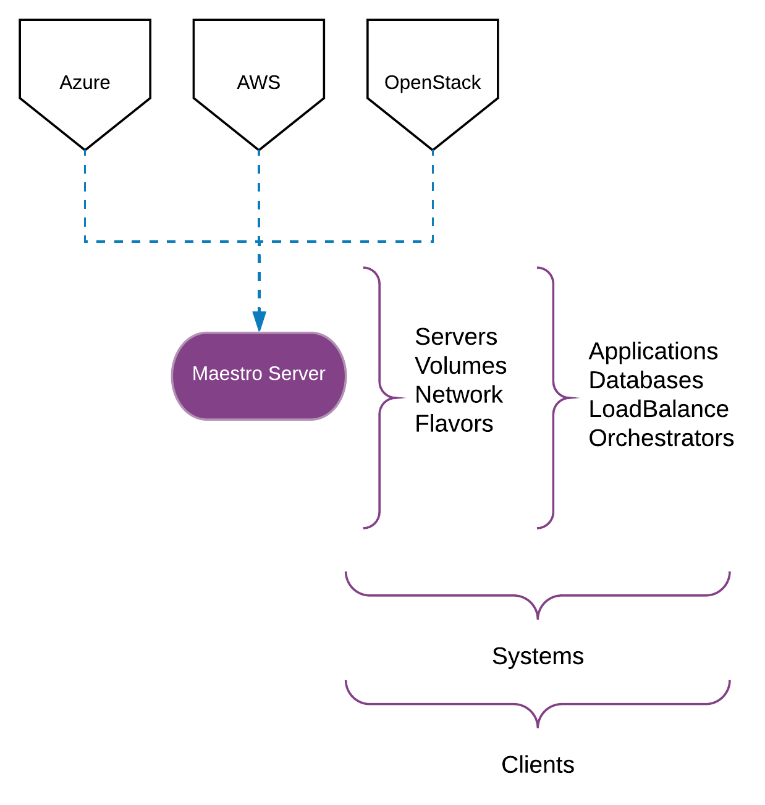

Overview
====================
Maestro Server is an open source software platform for management and discovery servers, apps, a system for Hybrid IT. It can manage small and large environments, offer a possibility to centralize all data for multiple cloud accounts.
You will be able to:

- Centralize all data about your server
- Continuously discover new servers and services of all environments
- Powerful reports and greater relation to servers, services, and apps
- Automatically create inventory for ansible

Introduction
------------
Maestro Server is be composed of 3 system.

> **Cloud inventory**: Catalog and manager system in multi-cloud environment

- Server manage in multi-cloud
- Reports with advanced filters
- ‎Scheduler commands with Ansible
- ‎Auto Discovery for cloud environment

.. Note::

  `See demo cloud inventory here <http://demo.maestroserver.io/>`_. 

> **App manager**: Automataze command services

- Command hooks in multiple servers.
- ‎Centralized manage server.
- Schedule task

> **Orchestrate architecture**: Orchestrate system for server and services.

- Orchestration architecture for complex system
- ‎State manager.

What is Maestro Server
**********************

Maestro was built to solve some problems we found in operating multi-cloud environments, multiple shared Devops culture team.

What problems does it solve?
****************************

New way in the technology world wit h new forms to think and act, new architecture in multicloud, microservices and etc, all this stuffs increase a complex path to be updated, in the same time teams grow and more, the knowledge split, it operation teams transform in squad horizontal service team, create a necessity to orchestrate people and data.

Maestro comes to help it operation teams to organize and audit multicloud infrastructure, Cloud Inventory arrive to substitute CMDB systems, auto-discovery servers, services and apps in organizing and smart way, its possible to classify each service, like database, message queues, vpns, api gateway, service mesh and etc, create a relation between servers and services, docs clusters, and points, targets all you need to be a complete and simple inventory.

How do I use it?
****************

Centralized database system like CMDB, centralized playbooks like Ansible Tower and centralized monitoring cloud system like ManageIQ