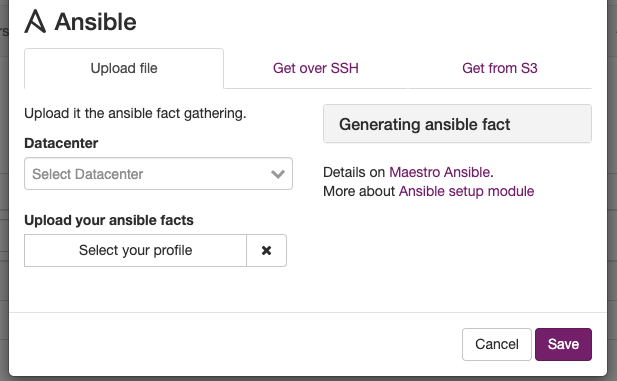
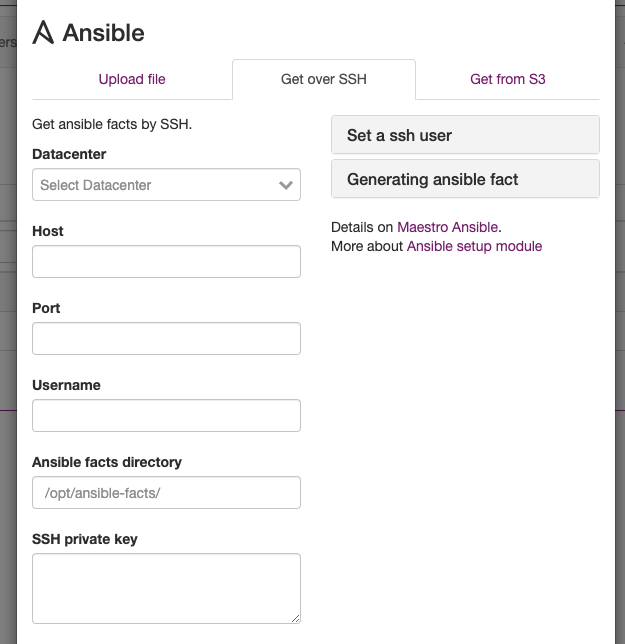
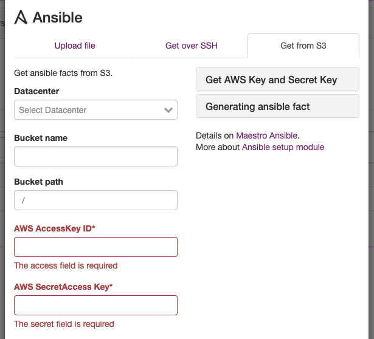

Using Ansible Facts
==========================

You can use ansible as a CMDB, first, you can generate Ansible output for your hosts, running

.. code-block:: bash

   mkdir out
   ansible -m setup --tree out/ all

Ansible will generate one file per host, next is to create a new connection on the resulting folder, Maestro can uses three method to get those files.

- Upload file
- Over ssh
- On S3 Bucket

------------

**Automatize the update process.**

You can create cron jobs over ansible facts onto ansible manager server to automatize the update process.

------------

**Resources**

+-------------------+
| Server-List:      |
+-------------------+
| volumes-list:     |
+-------------------+

------------

Upload ansible facts

Set over ssh

Using S3 bucket

------------

.. Note::
    
    PS:  PS:  There is scheduler job activated by default, each resource type have specifc window time, server-list will be updated for every 5 minutes, networks for every 2 weeks.
