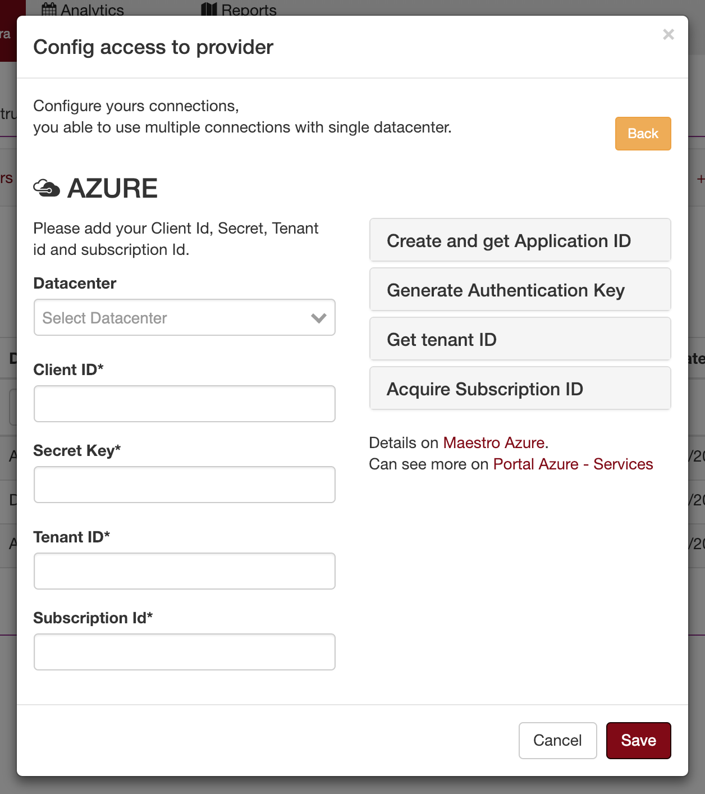

Connecting on Azure
======================

To register use client id, tenant id, subscription id and secret token

.. raw:: html

    <iframe style="max-width: 660px; width:100%; height: 415px" src="https://www.youtube.com/embed/BbHHtfuoCos" frameborder="0" allow="accelerometer; autoplay; encrypted-media; gyroscope; picture-in-picture" allowfullscreen></iframe>

-------------

Create and/or get Client ID
---------------------------

Create application in Azure Active Directory and you can then note the application ID.

1. Sign in to your Azure Account through the Azure portal.
2. Select Azure Active Directory.
3. Select App registrations.
4. Get Client ID and Tenant ID.

Generate Authentication Key
---------------------------

**Provide Permission**, select the application created and

1. Go to Settings, then Required permissions.
2. Click Add -> Select an API -> Windows Azure Service Management API and click Select.
3. Select required Delegated Permissions, click Select and then click Done.
4. Create a secret key
5. Select the application and go to Settings and Keys.
6. Add a description and expiry duration for the key and click Save.
7. The value of the key appears in the Value field.
                            
Get tenant ID
-------------

When programmatically signing in, you need to pass the tenant ID with your authentication request.

1. Select Azure Active Directory.
2. Select Properties.
3. Copy the Directory ID to get your tenant ID.

Acquire Subscription ID
-----------------------

Grant permission for the application to access subscription that you want to configure.

1. Assign a role to the new application.
2. On the Azure portal, navigate to Subscriptions.
3. Select the subscription for which you want to grant permission to the application and note the subscription ID. 
4. To grant permission to the application you created, choose Access Control (IAM).
5. Go to Add and Select a role. Pick the role as Reader. A Reader can view everything, but cannot make any changes to the resources of a subscription.
6. Select Azure AD user, group, or application in Assign Access to dropdown.
7. Type the application name in Select drop-down and select the application you created.

----------------

**List of permissions to grant.**

+-------------------------+---------------------------------------------------------------------------------------------------------+
| server-List             | compute virtual_machines                                                                                |
+-------------------------+---------------------------------------------------------------------------------------------------------+
| volumes-list            | compute disks                                                                                           |
+-------------------------+---------------------------------------------------------------------------------------------------------+
| snapshot-list           | compute snapshots                                                                                       |
+-------------------------+---------------------------------------------------------------------------------------------------------+
| images-list             | compute images                                                                                          |
+-------------------------+---------------------------------------------------------------------------------------------------------+
| network-list            | network network_interfaces  network public_ip_addresses  network route_tables  network virtual_networks |
+-------------------------+---------------------------------------------------------------------------------------------------------+

------------

Setup connection with Azure