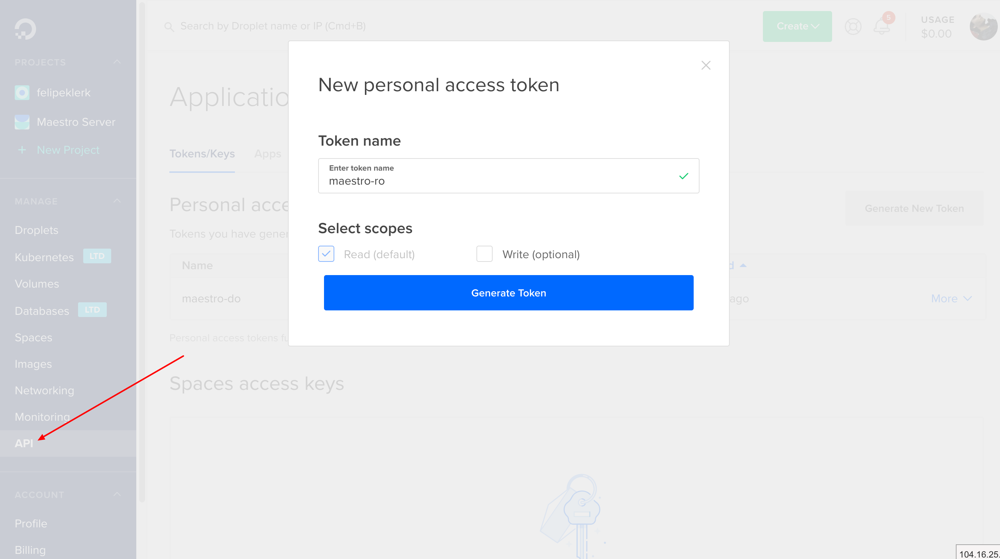
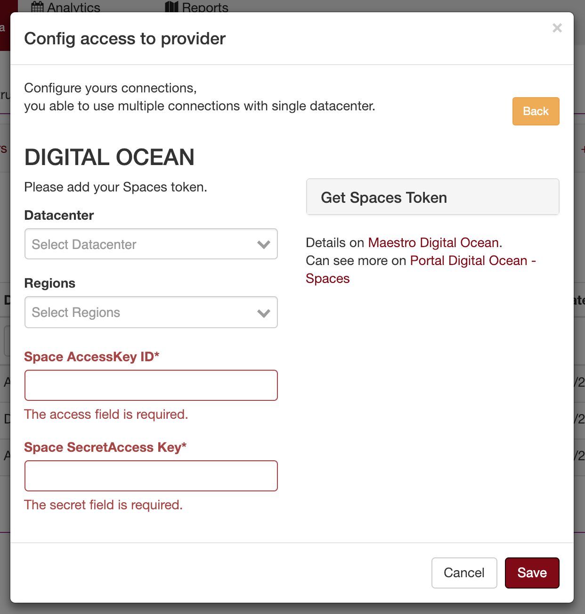

Connecting on Digital Ocean
==============================

To get the application token. Go to:

Getting the App Token
---------------------

To create a new token, go to Digital Ocean dashboard:

1. Click on the API on the main menu
2. Go to the Applications & API
3. On the Tokens/Keys tab. Go to the Personal access tokens section
4. Click on to ``Generate New Token``.

-------------

**List of permissions to grant.**

+-------------------------------+----------------------------------------+
| server-List                   | get_all_droplets                       |
+-------------------------------+----------------------------------------+
| loadbalance-list              | get_all_load_balancers                 |
+-------------------------------+----------------------------------------+
| volumes-list                  | get_all_volumes                        |
+-------------------------------+----------------------------------------+
| snapshot-list                 | get_all_snapshots                      |
+-------------------------------+----------------------------------------+
| cdns-list                     | get_all_cdns                           |
+-------------------------------+----------------------------------------+
| container-orchestration-list  | get_all_kubernetes                     |
+-------------------------------+----------------------------------------+
| images-list                   | get_my_images                          |
+-------------------------------+----------------------------------------+
| network-list                  | get_all_firewalls                      |
+-------------------------------+----------------------------------------+

------------

.. image:: ../../_static/screen/conn_do.png
   :alt: Maestro Server - Digital Ocean Setup

Setup connection with Digital Ocean

------------

Digital Ocean Spaces
====================

To register spaces key and secret key.

.. image:: ../../_static/screen/spaces_tokens.png
   :alt: Maestro Server - Digital Ocean Space tokens

Getting Spaces Token
--------------------

1. Click on the API on the main menu
2. Go to the Spaces token
3. On the Tokens/Keys tab.
4. Click on the ``Generate New Token on Spaces``, and gets the key and secret key.

------------

Setup connection on Digital Ocean Spaces