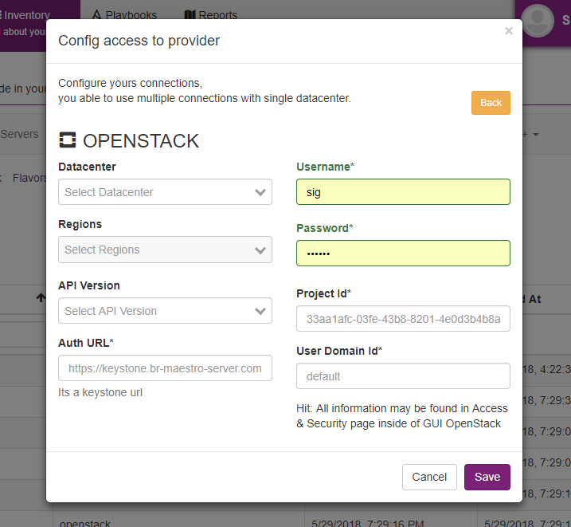
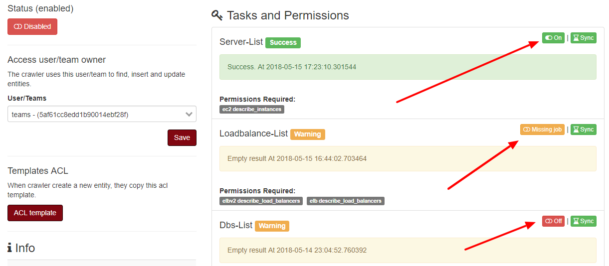

Connecting on OpenStack
==========================

To register one openstack account, use project name, url api, user, and password.

**List of permissions to grant.**

+-------------------+----------------------------------------------+
| Server-List:      | servers compute                              |
+-------------------+----------------------------------------------+
| Loadbalance-list: | load_balancers load_balancer                 |
+-------------------+----------------------------------------------+
| volumes-list:     | volumes block_store                          |
+-------------------+----------------------------------------------+
| snapshot-list:    | block_store snapshots                        |
+-------------------+----------------------------------------------+
| images-list:      | compute images                               |
+-------------------+----------------------------------------------+
| security-list:    | network security_groups                      |
+-------------------+----------------------------------------------+
| flavor-list:      | compute flavors                              |
+-------------------+----------------------------------------------+
| network-list:     | network networks, subnets, ports and routers |
+-------------------+----------------------------------------------+

If you like, choose how the resource will be synchronized with an active and inactive button.

------------

Setupconnection with OpenStack

------------

.. Note::
    
    PS:  PS:  There is scheduler job activated by default, each resource type have specifc window time, server-list will be updated for every 5 minutes, networks for every 2 weeks.

------------

Enable and disable the job