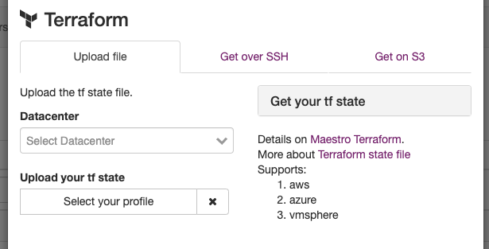

Using Terrafom State File
=========================

You can use terraform statefile as a CMDB.

Maestro can uses three method to get those files.

- By upload file
- Over ssh
- On S3 Bucket

You can use the same directory as the remote state folder.

------------

**Providers Support**

Maestro can crawler and find information based on:

+--------------+---------+---------+---------+--------+---------+--------------+
| Provider     | Servers | Volumes | Network | Images | Flavors | Applications |
+==============+=========+=========+=========+========+=========+==============+
| AWS          | yes     | yes     |         |        |         |              |
+--------------+---------+---------+---------+--------+---------+--------------+
| Azure        |         |         |         |        |         |              |
+--------------+---------+---------+---------+--------+---------+--------------+
| OpenStack    |         |         |         |        |         |              |
+--------------+---------+---------+---------+--------+---------+--------------+
| DigitalOcean |         |         |         |        |         |              |
+--------------+---------+---------+---------+--------+---------+--------------+
| VMSphere     |         |         |         |        |         |              |
+--------------+---------+---------+---------+--------+---------+--------------+

yes - Maestro can find and get informations about that resource
{empty} - That resource will be supported in a future releases.
no - Maestro won't support that feature

------------

.. Note::
    
    PS:  There is scheduler job activated by default, each resource type have specifc window time, server-list will be updated for every 5 minutes, networks for every 2 weeks.
