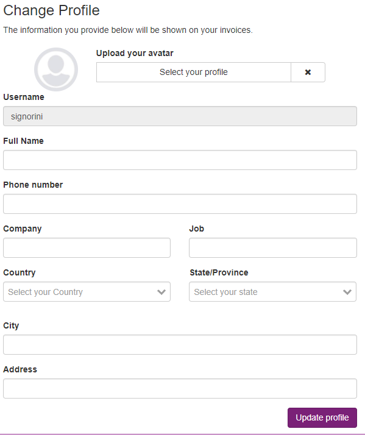

Access and Auth
====================

All entitites in Maestro has access roles, the access role 

Account / Profile
-----------------

On profile you can update your profile.

------------

    Profile fields

------------

ACL
---

All entities in Maestro has access roles, the access role, we have, each access role maybe in a team or in user.

+--------+------------------------------------------+
| Read:  | Have only read access                    |
+--------+------------------------------------------+
| Write: | Have read and write access (update)      |
+--------+------------------------------------------+
| Admin: | Able to delete, grant and revoke access. |
+--------+------------------------------------------+

------------

.. figure:: ../../_static/screen/acl.png

    You can change any acl point for specify user or team.

------------

Change password
---------------

If you like to change password, you need to go on profile > change password

------------

.. figure:: ../../_static/screen/newpass.png

    New pass