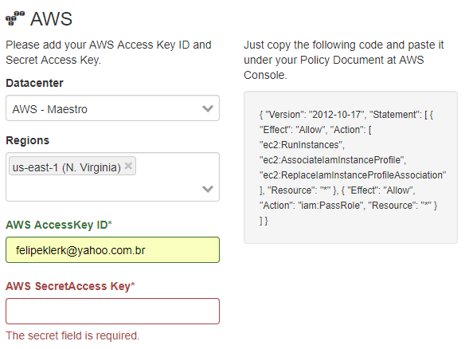

Connecting on AWS
====================

To connect a one aws account, it uses an access_key and secret_key

.. raw:: html

    <iframe style="max-width: 660px; width:100%; height: 415px" src="https://www.youtube.com/embed/KhwUY85xsFU" frameborder="0" allow="accelerometer; autoplay; encrypted-media; gyroscope; picture-in-picture" allowfullscreen></iframe>

------------

Go to IAM service
-----------------

Go to iam services on you AWS account dashboard.

Create an user - SecurityAudit
-------------------------------

1. Go to user tab
2. Add user, select the access type as a ``programmatic access``
3. Choose to attach an existed policy on user
4. Select ``SecurityAudit`` policy

Getting AWS Key and Secret Key
------------------------------

Copy and paste the aws key and secret key

------------

**List of permissions to grant.**

+-------------------------+---------------------------------------------------------------------------------------------------------------------------------------------------------------------------------------------------------------------------+
| server-List             | ec2 describe_instances                                                                                                                                                                                                    |
+-------------------------+---------------------------------------------------------------------------------------------------------------------------------------------------------------------------------------------------------------------------+
| loadbalance-list        | describe_load_balancers and describe_load_balancers                                                                                                                                                                       |
+-------------------------+---------------------------------------------------------------------------------------------------------------------------------------------------------------------------------------------------------------------------+
| dbs-list                | rds describe_db_instances                                                                                                                                                                                                 |
+-------------------------+---------------------------------------------------------------------------------------------------------------------------------------------------------------------------------------------------------------------------+
| storage-object-list     | s3 list_buckets                                                                                                                                                                                                           |
+-------------------------+---------------------------------------------------------------------------------------------------------------------------------------------------------------------------------------------------------------------------+
| volumes-list            | ec2 describe_volumes                                                                                                                                                                                                      |
+-------------------------+---------------------------------------------------------------------------------------------------------------------------------------------------------------------------------------------------------------------------+
| cdns-list               | cloudfront list_distributions                                                                                                                                                                                             |
+-------------------------+---------------------------------------------------------------------------------------------------------------------------------------------------------------------------------------------------------------------------+
| snapshot-list           | ec2 describe_snapshots                                                                                                                                                                                                    |
+-------------------------+---------------------------------------------------------------------------------------------------------------------------------------------------------------------------------------------------------------------------+
| images-list             | ec2 describe_images                                                                                                                                                                                                       |
+-------------------------+---------------------------------------------------------------------------------------------------------------------------------------------------------------------------------------------------------------------------+
| autoscaling-List        | autoscaling describe_auto_scaling_groups                                                                                                                                                                                  |
+-------------------------+---------------------------------------------------------------------------------------------------------------------------------------------------------------------------------------------------------------------------+
| brokers-List            | sqs list_queues                                                                                                                                                                                                           |
+-------------------------+---------------------------------------------------------------------------------------------------------------------------------------------------------------------------------------------------------------------------+
| cache-List              | elasticache describe_cache_clusters                                                                                                                                                                                       |
+-------------------------+---------------------------------------------------------------------------------------------------------------------------------------------------------------------------------------------------------------------------+
| smtp-List               | ses list_identities                                                                                                                                                                                                       |
+-------------------------+---------------------------------------------------------------------------------------------------------------------------------------------------------------------------------------------------------------------------+
| serverless-List         | lambda list_functions                                                                                                                                                                                                     |
+-------------------------+---------------------------------------------------------------------------------------------------------------------------------------------------------------------------------------------------------------------------+
| serverless-support-List | lambda list_layers                                                                                                                                                                                                        |
+-------------------------+---------------------------------------------------------------------------------------------------------------------------------------------------------------------------------------------------------------------------+
| dynamodb-List           | dynamodb list_tables                                                                                                                                                                                                      |
+-------------------------+---------------------------------------------------------------------------------------------------------------------------------------------------------------------------------------------------------------------------+
| gateway-List            | apigateway get_rest_apis                                                                                                                                                                                                  |
+-------------------------+---------------------------------------------------------------------------------------------------------------------------------------------------------------------------------------------------------------------------+
| security-list           | ec2 describe_security_groups                                                                                                                                                                                              |
+-------------------------+---------------------------------------------------------------------------------------------------------------------------------------------------------------------------------------------------------------------------+
| network-list            | ec2 describe_vpcs, describe_subnets, describe_vpc_peering_connections, describe_vpn_gateways, describe_vpc_endpoints, describe_route_tables, describe_network_interfaces, describe_nat_gateways and describe_network_acls |
+-------------------------+---------------------------------------------------------------------------------------------------------------------------------------------------------------------------------------------------------------------------+

------------

Setup connection on AWS
