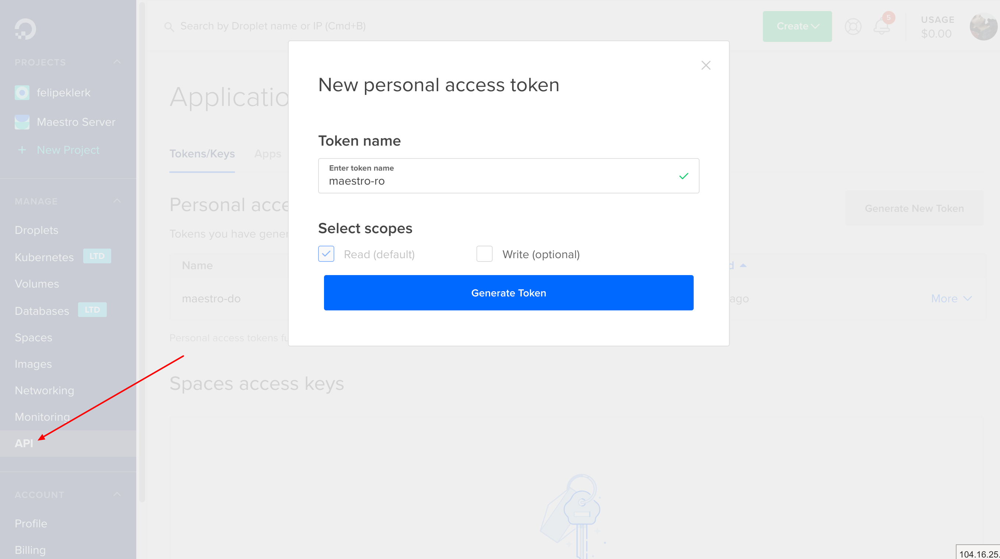
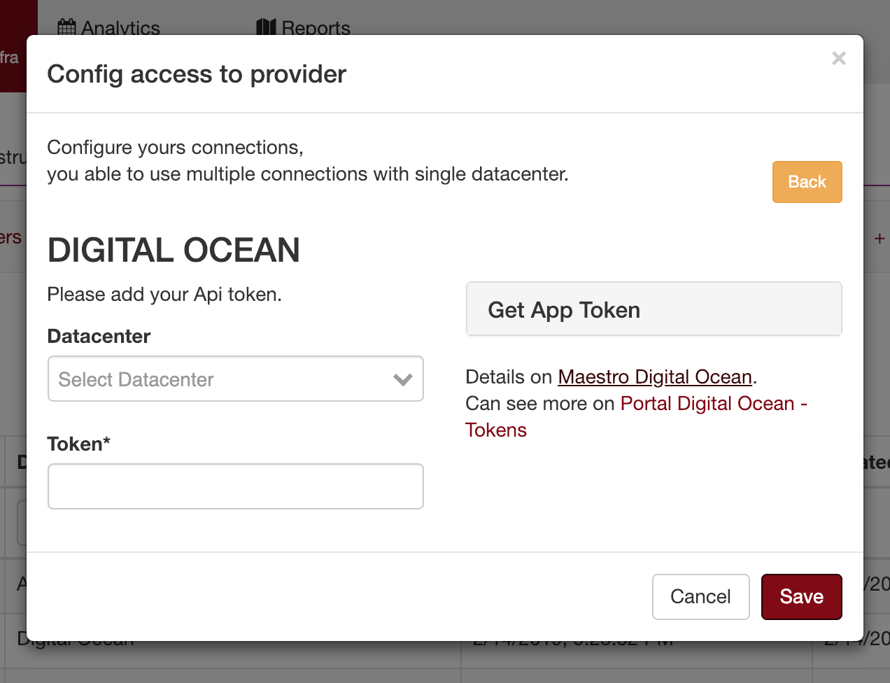
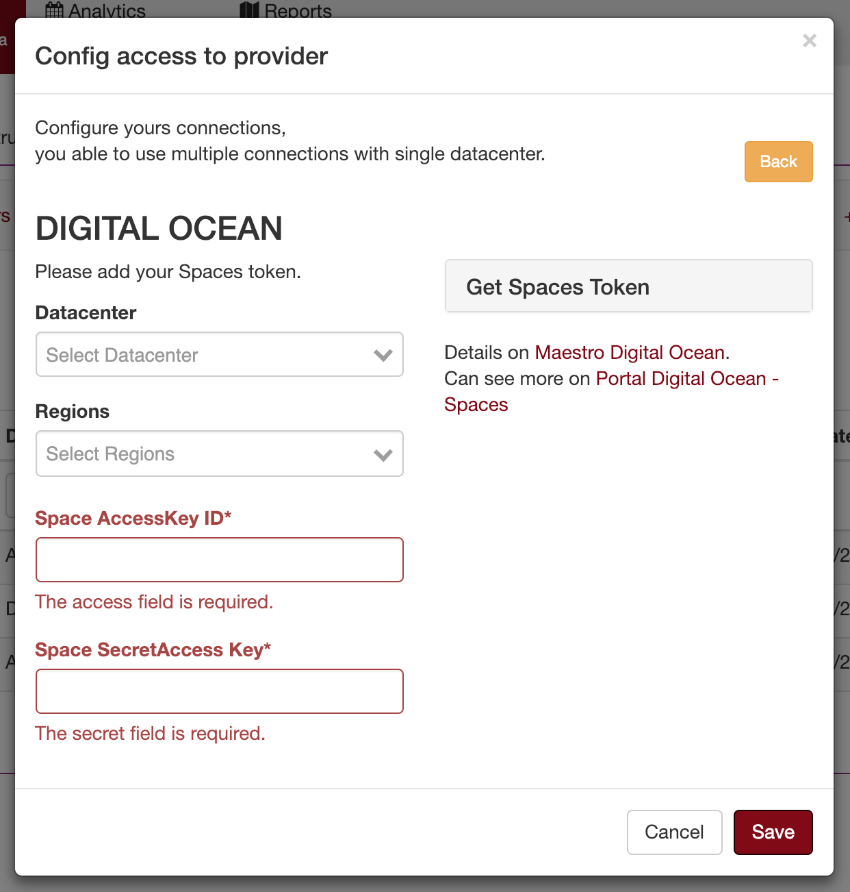

Connectiong with Digital Ocean
==============================

To register one application token.

Get App Token
-------------

To create a new token, enter on Digital Ocean dashboard:

1. Click the API link in the main navigation
2. Takes you to to the Applications & API
3. On the Tokens/Keys tab. In the Personal access tokens section
4. Click the Generate New Token.

-------------

**Synchronized and permissions to grant.**

+-------------------------------+----------------------------------------+
| server-List                   | get_all_droplets                       |
+-------------------------------+----------------------------------------+
| loadbalance-list              | get_all_load_balancers                 |
+-------------------------------+----------------------------------------+
| volumes-list                  | get_all_volumes                        |
+-------------------------------+----------------------------------------+
| snapshot-list                 | get_all_snapshots                      |
+-------------------------------+----------------------------------------+
| cdns-list                     | get_all_cdns                           |
+-------------------------------+----------------------------------------+
| container-orchestration-list  | get_all_kubernetes                     |
+-------------------------------+----------------------------------------+
| images-list                   | get_my_images                          |
+-------------------------------+----------------------------------------+
| network-list                  | get_all_firewalls                      |
+-------------------------------+----------------------------------------+

------------

Setup connection with Digital Ocean

------------

Digital Ocean Spaces
====================

To register spaces key and secret key.

.. image:: ../../../_static/screen/spaces_tokens.png
   :alt: Maestro Server - Digital Ocean Space tokens

Get Spaces Token
----------------

1. To create a new token, enter on dashboard:
2. Click the API link in the main navigation
3. Takes you to to the Spaces token
4. On the Tokens/Keys tab.
5. Click the Generate New Token on Spaces, get the key and secret key.

------------

Setup connection with Digital Ocean Spaces