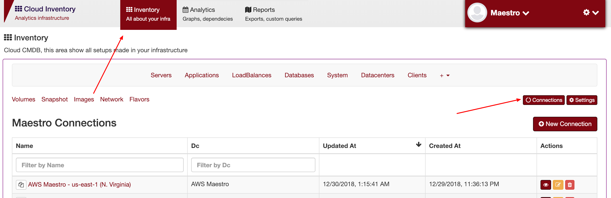
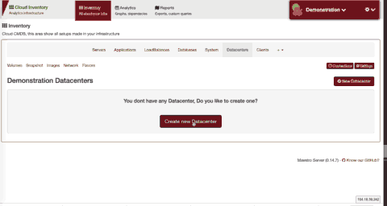

Auto Discovery
====================

To setup new connections in auto-discovery:

- Create datacenters (select all regions with you like to discovery)
- Create a connection - Select previous datacenters created and regions
- Pass aws key and secret - Maestro need only a readyonly permission, the best pratice is, create a specific key for maestro

1 - Create datacenters

2 - Create connection - Go inventory > connections.

Create a iam key with read only permission.

Access connection

In version 0.1, we have two providers:

.. toctree::
   :maxdepth: 2

   aws
   azure
   digitalocean
   openstack

------------

FAQ
---

- **Permission error**
    
    If through Unauthorized error, you need to grant ready only permission, in AWS you need to create IAM and grant these permissions.

- **Infinitive process loading**

    Its common problem, Maestro needs two services to execute a successful synchronize, Discovery APP and RabbitMQ, normally when discovery app is down, we have infinite process message (because server app notify to start a process, and discovery app need to finish with Success process). 
    Guarantees if discovery app up and running and if it's connected correctly with rabbitmq.

For debbug, use stdout docker, like

.. code-block:: bash

    docker-compose logs discovery-maestro
    # or
    docker-compose logs discovery-celery