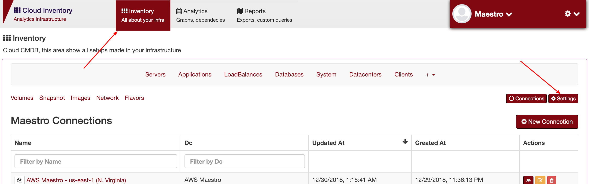
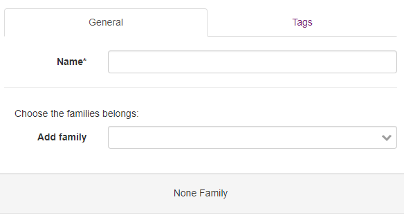
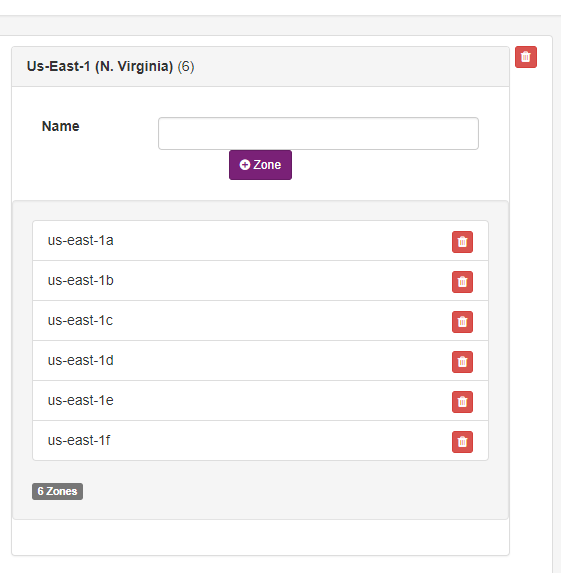

Options and configurations
==========================

-----

Services
--------

To create a new services, you can go to ``settings -> services`` and click on add new service:

------------

You can add, remove or update any service filled on Maestro database.

------------

Config Options
--------------

You can add or change any options.

==================== ==============================================
application_options  Applications options
clients_options         
connections          Time scheduler and crawler connections
database_options
datacenter_options
env_options
server_options
services_options     Services initial setup
system_options
==================== ==============================================

------------

As an example those are contacts found out it on ``clients_options``.

.. image:: ../../_static/screen/rr_config.png
   :alt: Maestro Server - Register new service

------------

Regions and zones
-----------------

You can add a new regions and zones, go to ``settings -> regions and zones``:

------------

The default regions and zones options.