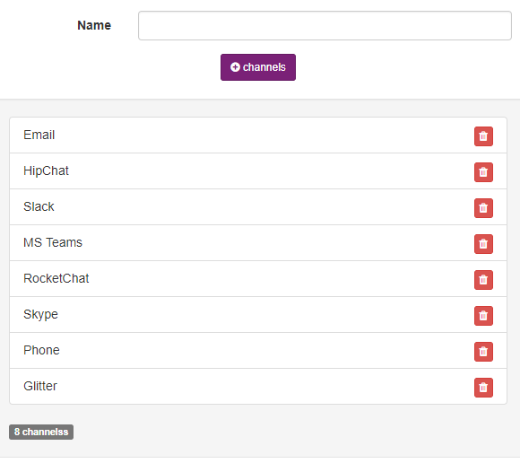

Config / Settings
====================

Services
--------

You can create and delete new services used in servers and apps services field, choose a name, family and some tags.

------------

.. figure:: ../../_static/screen/service_reg.png

    Register a new, or update service.

------------

Config Options
--------------

Config options, its used in point part options, like environments, types of services, and time to schedule updates providers lists.

==================== ====================
application_options  Options of apps
clients_options         
connections          Time scheduler and crawler connections
database_options
datacenter_options
env_options
server_options
services_options     Initial setup of services
system_options
==================== ====================

------------

    Maestro configs, created when run migration command.

------------

Regions and zones
-----------------

Regions and zones, if you like, its possible to configure and pre-define some regions and zones.

------------

.. figure:: ../../_static/screen/rr_1.png

    Pre-define regions and zones.

------------