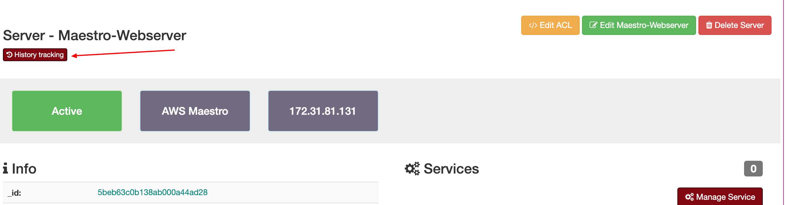

History Track
=============
`Inventory > Single Application > History Track`

You can visualise all changes were made by users or by crawlers as a discovery or analytics. The audit service can analyse the difference between an old and a new entry and then record it.
 
------------

------------

Example of tracking changes page.

.. image:: ../../_static/screen/tracking.png
   :alt: Maestro Server - History tracking

