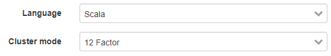
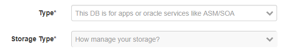
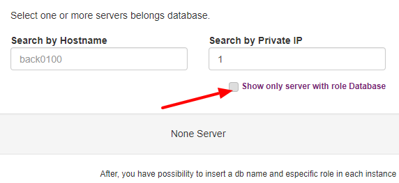
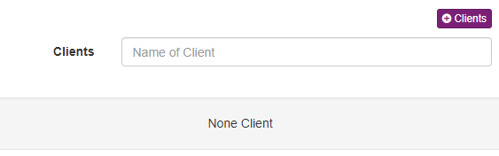

Inventory
=========

Inside inventory there are a groups of entities organize by responsabilitie accordly architecture point of view.

Servers
-------

The most import fields in server register is:

============ =============================================================================================================================
Field        Functional 
============ ============================================================================================================================= 
Hostname     Hostname, accept duplicate hostname per team, but the inveotry will warning about this.
Ipv4 Private Ipv4 private, same situation of hostname (accept duplicate but will warning) 
Ipv4 Public  Ipv4 public, only for external servers.
OS           Base is most basic form, like Linux adn Windows, Distro normally use for linux, like ubuntu, centos, and version its a number
CPU          CPU
Memory       Memory
Environment  Production | Development | Stage
============ =============================================================================================================================

------------

.. figure:: ../../_static/screen/sv_os.png

    Setup OS server

------------

You have some tabs,

============ ======================================================================================================================================================================================================== 
Field        Functional 
============ ======================================================================================================================================================================================================== 
Storage      Add your storage information, mount path, size in GB and if is a root device, some cloud maybe bring news informations.
Datacenter   Provider, region and zones, if this server still in cloud Environment you can put id in id_instance, will be create a link and Maestro will know if its duplicate when execute a auto discovery servers.
Auth         Used to register a methods to authenticate in servers.
Service      Register all services its run inside a servers, this information its used to create some links with applications inventory and used in ``Application Manager`` system.
============ ======================================================================================================================================================================================================== 

.. Note::

    Services is a very important field in servers, which this information the system will try to find some relation with applications, for example if you register Oracle Database, and create a database and register a relation between this servers, the system will automatically create a service relation.

------------

.. figure:: ../../_static/screen/sv_ddc.png

    Assing a dc name, region and zone.

------------

.. figure:: ../../_static/screen/sv_auth.png

    Register, which mode you can to access and authenticate on server.   

------------

.. figure:: ../../_static/screen/sv_service.png

    Related services running.

------------

Apps
----

Apps are it all services with is a business responsibility, normally it is an application made by the developer and deploys.

Some fields:

============ =============================================================================================================================
Field        Functional 
============ ============================================================================================================================= 
Name         Hostname, accept duplicate hostname per team, but the inveotry will warning about this.
Environment  Production | Development | Stage
Language
Cluster mode
============ =============================================================================================================================

Specification

============ ======================================================================================================================================================================================================== 
Field        Functional 
============ ======================================================================================================================================================================================================== 
Role         Point information like endpoint, commands, health check, its good for doc.
System       Systems related it.
Server       Servers deployed by app.
Deploy       List of ways to deploy this app.
============ ======================================================================================================================================================================================================== 

------------

    Choose language like node or php.

------------

Databases
---------

Databases are it all with data persistence responsibility, can be relational, norelational, in memory, distribuited storage and etc.

We have some specific database, in this case, can have exclusive form

============ ======================================================================================================================================================================================================== 
Field        Functional 
============ ======================================================================================================================================================================================================== 
Oracle       You can register ASM DB, CDBs, configurations like Rac, grid system and golden gate backups
MySQL        Register some features like Master/Slave, Cluster with Aurora, backups services and more.
============ ======================================================================================================================================================================================================== 

**Oracle**

Support version 10g, 11g and 12g

    Choose how Oracle will be storage data, can be local disk, networks disk or ASM.

------------

.. figure:: ../../_static/screen/db_oracle_cluster.png

Choose how Oracle will be run, single node, RAC/Grid mode.

------------

.. figure:: ../../_static/screen/db_oracle_cbds.png

    Which CDBS run in oracle database.

------------

Which servers this db run, if is single node, its only one server, but if is rac setup, will be run in multiple servers.

**MySQL**

Support MySQL, AWS Aurora, MariaDB, Percona and etc

.. figure:: ../../_static/screen/db_mysql_type.png

    Version and mode to run.

**Other databases**

Partial support whitch all bases

.. figure:: ../../_static/screen/db_other_type.png

    Version and mode to run.

------------

============ ======================================================================================================================================================================================================== 
Field        Functional 
============ ======================================================================================================================================================================================================== 
Spec         Point information like endpoint, port, commands, health check, its good for doc.
Datacenters  Provider, (only by third party services)
Server       Servers deployed by db.
CDBS         Used only by Oracle DB
System       Systems related it.      
============ ======================================================================================================================================================================================================== 

------------

Datacenters
-----------

Register all clouds, bare metal, providers and etc.

============ ======================================================================================================================================================================================================== 
Field        Functional 
============ ======================================================================================================================================================================================================== 
Name         Identity name
Provider     Choose a provider, or create a new one
Regions      Choose or create regions
Zones        Choose or create zones
============ ======================================================================================================================================================================================================== 

------------

.. figure:: ../../_static/screen/dc.png

    List of datacenters, with instances, regiions and zones

------------

.. figure:: ../../_static/screen/dc_regions.png

    You can choose the provider, regions and zones.

------------

.. figure:: ../../_static/screen/dc_regions2.png

    Choose regions or create it.

------------

LoadBalances
------------

Service with responsibility of distributed request through other servers

============ ======================================================================================================================================================================================================== 
Field        Functional 
============ ======================================================================================================================================================================================================== 
Service      Which is service?
============ ======================================================================================================================================================================================================== 

============ ======================================================================================================================================================================================================== 
Field        Functional 
============ ======================================================================================================================================================================================================== 
Targets      Which servers this lb send it
Servers      Which servers this lb still installed
Spec         Endpoint and healthcheck
============ ======================================================================================================================================================================================================== 

------------

    Docs a endpoint and healthcheck used in app.

------------

.. figure:: ../../_static/screen/lb_targets.png

    Select loadbalance targets.

------------

System
------

A group of application, databases, loadbalances and etc, compond a unique system.

============ ======================================================================================================================================================================================================== 
Field        Functional 
============ ======================================================================================================================================================================================================== 
Links        Some useful links
Clients      Relation to this system and client
============ ======================================================================================================================================================================================================== 

------------

    Select owner of system

------------

Clients
-------

SLA owner, clients

================= ======================================================================================================================================================================================================== 
Field             Functional 
================= ======================================================================================================================================================================================================== 
Contacts/Channel  How contact the client
================= ======================================================================================================================================================================================================== 

------------

Services
--------

Common program running inside on server 

.. figure:: ../../_static/screen/service_reg.png

    Create a new service, to use in server and any app.