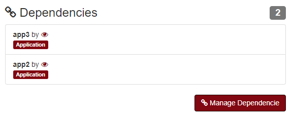

Apps
----
`Inventory > Application`

Applications are a program or group of programs designed for business responsibility.

Apps fields:

============ =============================================================================================================================
Field        Description
============ =============================================================================================================================
Name         Hostname
Environment  Production | Development | Stage
Language     What language this application was made.
Cluster mode
============ =============================================================================================================================

Specification

============ ========================================================================================================================================================================================================
Field        Description
============ ========================================================================================================================================================================================================
Role         Endpoint, commands, health check and more.
System       Accountant system/s.
Server       Where the application are running.
Deploy       List of ways to deploy this app.
============ ========================================================================================================================================================================================================

------------

.. image:: ../../../_static/screen/app_language.png
   :alt: Maestro Server - App Language

Selecting a language that applications was made. As an example, node or php.

------------

Add dependency

.. Note::

        A given applications with connects to this application, as an example webserver connects to database, so database is a dependency of webserver.

Adding dependencies.
