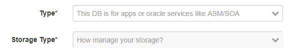
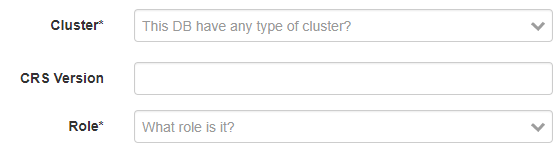
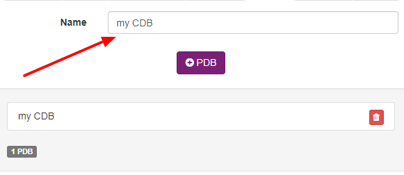
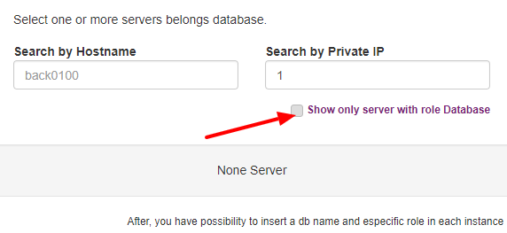
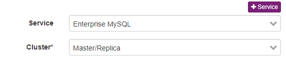
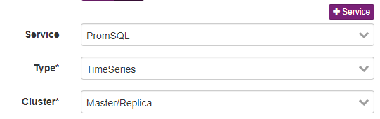

Databases
---------
`Inventory > Database`

Databases are a programs to manage data store, can be relational and no relational.

The database inventory have a exclusive form for Oracle and MySQL, otherwise the generic form are able to fit on all databases types.

============ ======================================================================================================================================================================================================== 
Field        Description 
============ ======================================================================================================================================================================================================== 
Oracle       You can register ASM DB, CDBs, RAC, grid system and/or golden gate backups
MySQL        It able to register features as Master/Slave, Aurora cluster, backups setups and more.
============ ======================================================================================================================================================================================================== 

**Oracle**

Support version 10g, 11g and 12g

    Choose how Oracle will be storage the data, as a local disk, ASM or distributed storage system.

------------

Choose how Oracle will be run, single node, RAC/Grid mode.

------------

Which CDBS run on oracle database. 

------------

Which servers this db ran, if is a single node, a rac or it running on multiple servers.

-----

**MySQL**

Support MySQL, AWS Aurora, MariaDB, Percona and etc

Which version and mode this db are.

**Generic database**

Generic support for all databases

------------

============ ======================================================================================================================================================================================================== 
Field        Description 
============ ======================================================================================================================================================================================================== 
Spec         Endpoint, port, commands, health check and more.
Datacenters  A given datacenter.
Server       Which servers this database are running.
CDBS         CDBS used by Oracle DBs.
System       Accountant system/s.
============ ======================================================================================================================================================================================================== 