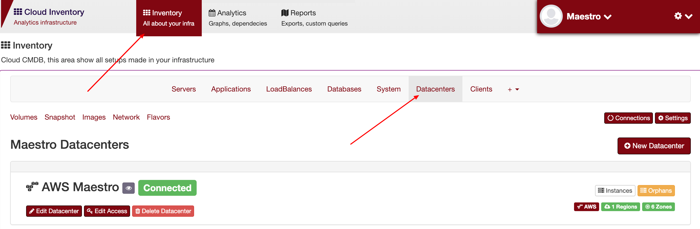
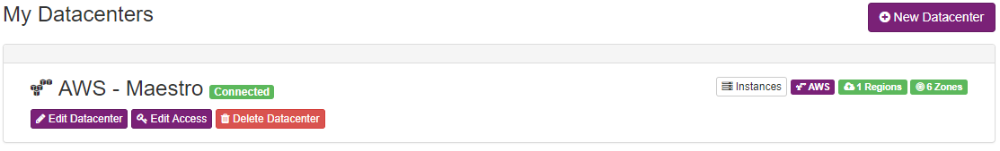
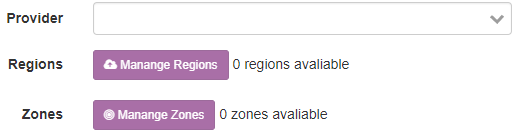
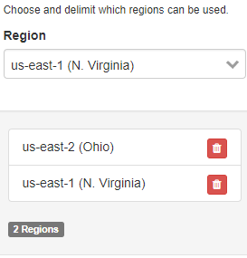

Datacenters
-----------
`Inventory > Datacenter`

Register all clouds, bare metal, providers and etc.

============ ======================================================================================================================================================================================================== 
Field        Functional 
============ ======================================================================================================================================================================================================== 
Name         Identity name
Provider     Choose a provider, or create a new one
Regions      Choose or create regions
Zones        Choose or create zones
============ ======================================================================================================================================================================================================== 

------------

List of datacenters, with instances, regiions and zones

------------

You can choose the provider, regions and zones.

------------

Choose regions or create it.
