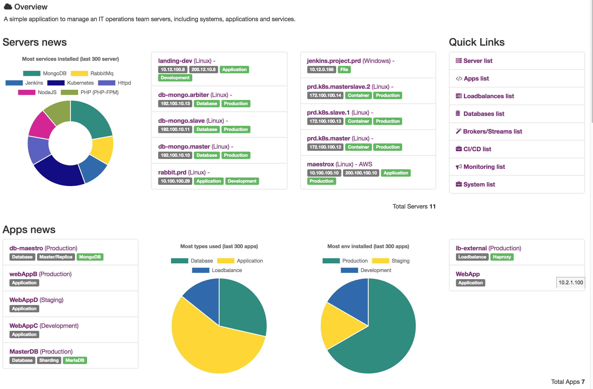

Inventory
=========

You can view your servers by applications, organized by systems, including the possibility of knowing which customer owns each system, in a single and powerful dashboard.

**It will be easy to:**

- Control multi-environment
- Track ownership usage
- Easy to visualize the relationship between microservices
- Correlation between teams/systems
- Track costs
- Easy way to document high architecture systems

.. toctree::
   :maxdepth: 2

   datacenters
   servers
   apps
   resources
   databases
   loadbalances
   system
   clients
   services