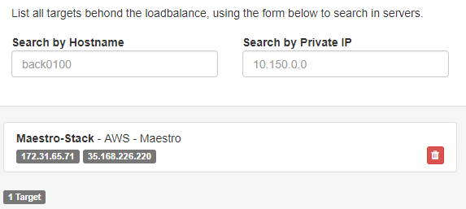

LoadBalances
------------
`Inventory > Loadbalance`

Service with responsibility of distributed request through other servers

============ ======================================================================================================================================================================================================== 
Field        Functional 
============ ======================================================================================================================================================================================================== 
Service      Which is service?
============ ======================================================================================================================================================================================================== 

============ ======================================================================================================================================================================================================== 
Field        Functional 
============ ======================================================================================================================================================================================================== 
Targets      Which servers this lb send it
Servers      Which servers this lb still installed
Spec         Endpoint and healthcheck
============ ======================================================================================================================================================================================================== 

------------

.. image:: ../../../_static/screen/lb_spec.png
   :alt: Maestro Server - Loadbalancers

Docs a endpoint and healthcheck used in app.

------------

Select loadbalance targets.
