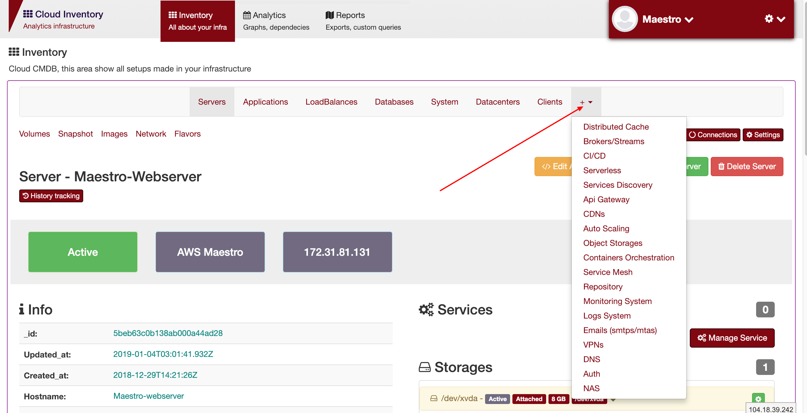
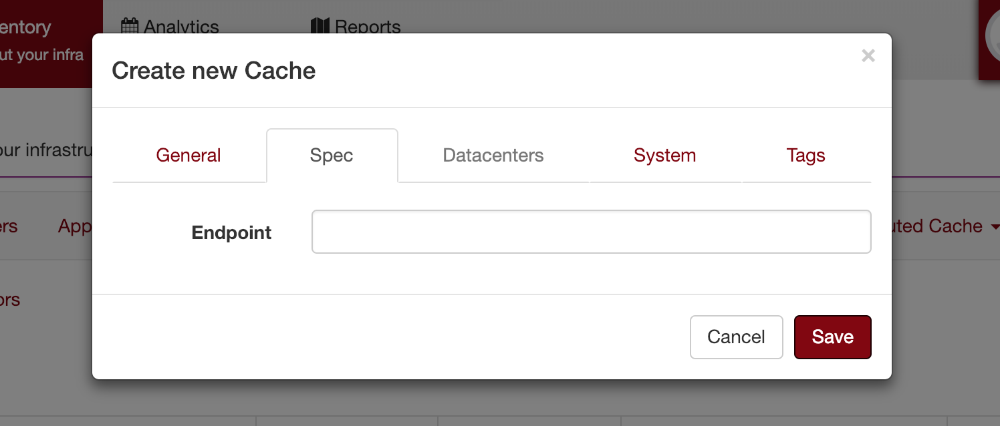

Resources
---------
`Inventory > ${Resource}`

Resources is a no-bussiness application, can be brokers, databases, loadbalances, service logs, dns and more.

Resources types:

========================== =============================================================================================================================
Family                      Description 
========================== ============================================================================================================================= 
Distributed cache           Cache system, as a Redis, Memcache and etc.
Brokers/Streams             Message or streams system, can be RabbitMQ, SQS, Kafka, Spark Streams and more.
CI/CD                       Ci Tools, as an Jenkins, Atlassian Stack, AWS Pipeline and more.
Serverless                  Cloud functions, as an AWS lambdas, step functions, google function, Kuberless and more.
Services Discovery          Consul, etcD, hystrix can be consired as a service discovery.
Api Gateway                 Api Gateway service, like Kong, AWS api gateway and/or a nginx.
CDNs                        CDNs services, cloudflare, akamai, cloud front and etc.
Auto Scaling                Autoscaling setup
Objects Storages            Objects storages, S3, GlusterFS, Ceph, DO Storages and more.
Containers Orchestration    Main pieces of orchestration tools, kubernetes master/slave node, eks nodes, docker swarm nodes, mesos and etc
Service Mesh                Like Linkerd, IstIO, Consul or AWS x-ray
Repository                  Nexus3, npm repository, docker repository, S3, private pip, nuget, gems, maven and more
Monitoring System           Prometheus, New Relic, Data dog, zabbix, nagios and etc
Logs System                 ELK stack, data dog, graylog and etc
Emails                      SMTP servers, postfix, or third service as a sendgrid
VPNs                        VPNs Gateways
DNS                         Bind9, route 53 and etc.
Auth                        Authetication/Authorization systems, as an AD, LDAP, IAMs and etc
NAS                         NAS Gateway
Corporate                   ERP, internal services, as an Hana SAP, Protheus and more.
========================== =============================================================================================================================

Specification

============ ======================================================================================================================================================================================================== 
Field        Description 
============ ======================================================================================================================================================================================================== 
System       Accountant system/s.
Server       Where the resource are running.
Cluster      The service are running on a cluster mode.
Spec         Endpoint, commands, health check and more.
============ ======================================================================================================================================================================================================== 

