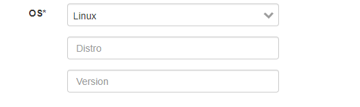
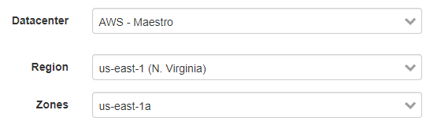
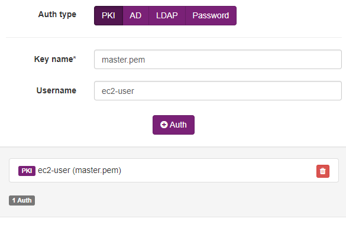
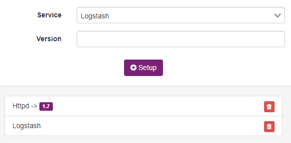
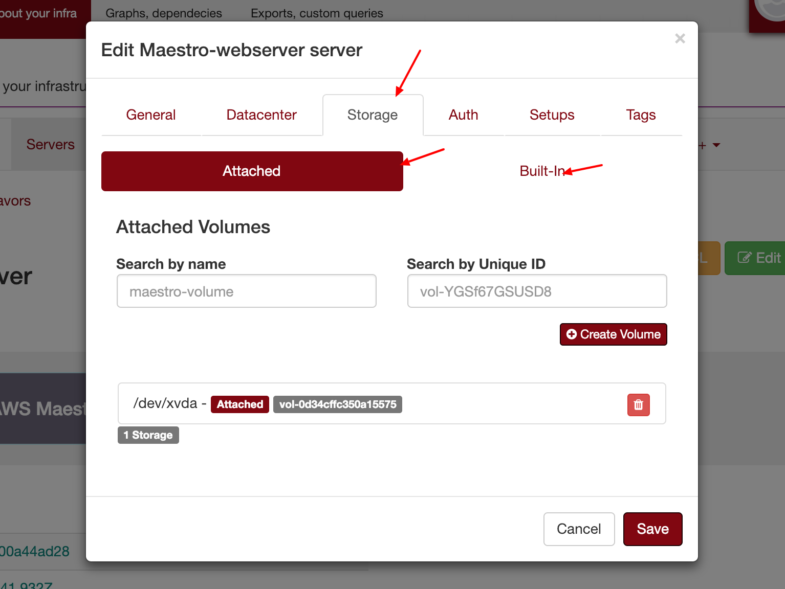
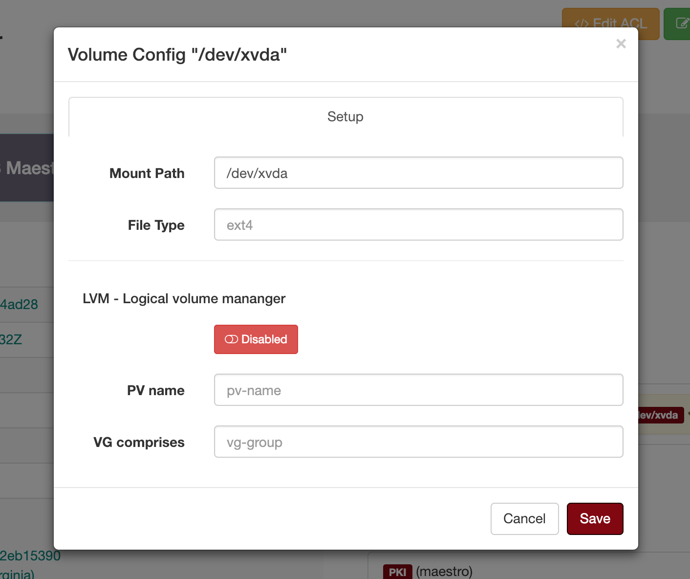
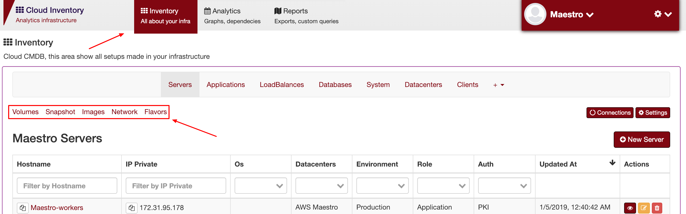

Servers
-------
`Inventory > Server`

Server is a computer or a single prograam instance, which manages access to a centralized resource or service in a network.

============ =============================================================================================================================
Field        Functional 
============ ============================================================================================================================= 
Hostname     Hostname, accept duplicate hostname per team.
Ipv4 Private Ipv4 private, It will warning if there are any duplication, 
Ipv4 Public  Ipv4 public, only for external servers.
OS           Operation system can be Linux adn Windows. Distro can be ubuntu, centos or any other.
CPU          CPU
Memory       Memory
Environment  Production | Development | Stage | ...
============ =============================================================================================================================

------------

Selecting the OS

------------

Server details

============ ======================================================================================================================================================================================================== 
Field        Functional 
============ ======================================================================================================================================================================================================== 
Storage      Add a storage information, mount path, size in GB and if is a root device, some cloud hame a specifc data information.
Datacenter   Providers, region and zones, if this server still in cloud Environment you can put the instnace id on id_instance field. It will be create a relation and Maestro won't duplicate this server.
Auth         Dummy information about how the team can loggin into servers.
Service      Show up all services running, I can be used in ``Application Manager`` system to track the service configuration.
============ ======================================================================================================================================================================================================== 

------------

Assing a dc name, region and zone.

------------

How you can to access and authenticate on that server.   

------------

.. Note::

   Services can be a very usefull field, Maestro are able to correlate services installed on servers and applications,as an example, you create a Oracle Database on Databases applications, then you can create a new server and assign this server to the database, Maestro automatically do a service/application bound.

Related services.

------------

**Volumes**

Can be attached or built-in:
 
 - **Attached** are network storage or distributed storage service (ex: NFS)
 
 - **built-in** is a hard drive setted, very common on bare metal.

After created the volume you will be able to describe awhere the mount path are, which file type, and a virtual volume configuration (LVM).

------------

**Cloud Server Resources**

Volumes, flavors and images were servers resources provide by cloud providers, on top of servers you can create/list those resources.

- **Volumes**: List of volumes (ex: EBS, HardDisk)

- **Flavors**: Instance flavors. 

- **Images**: List of images, it used to build new servers. [As a template]

- **Network**: Network provider resources, as an example security groups, acls, vpcs, subnets and etc.

