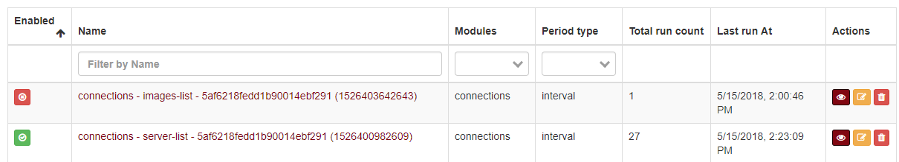
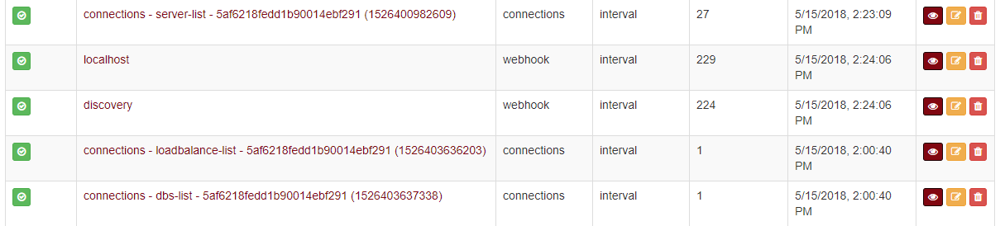
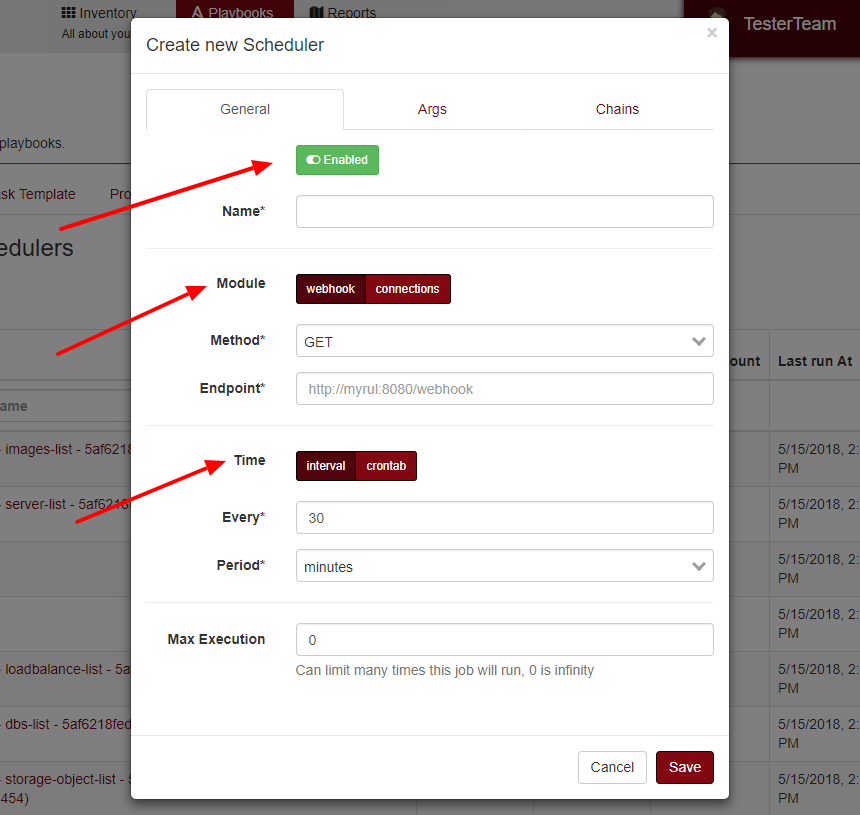

Scheduler
=========

Scheduler section normally is used to automatize a polling synchronization in connections and playbooks, but you can create a custom schedule.

------------

You can list all schedules, the first column show if that schedule is enabled or disabled.

    List Scheduler

------------

Details for connections schedulers, each time you create a new connection, automatically will create a lot of schedules, each schedule represents resources tracked if you like you can change the time processed of each schedule.

    Total counts

------------

You can create a custom schedule, normally is rest calling.

    Creating      