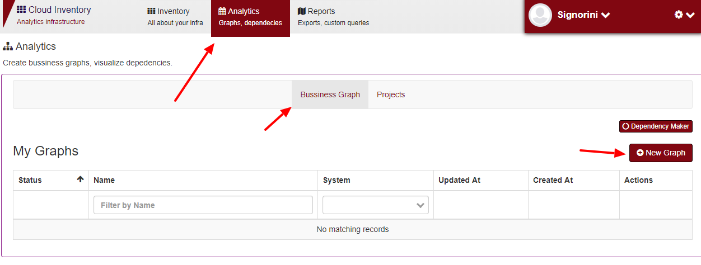
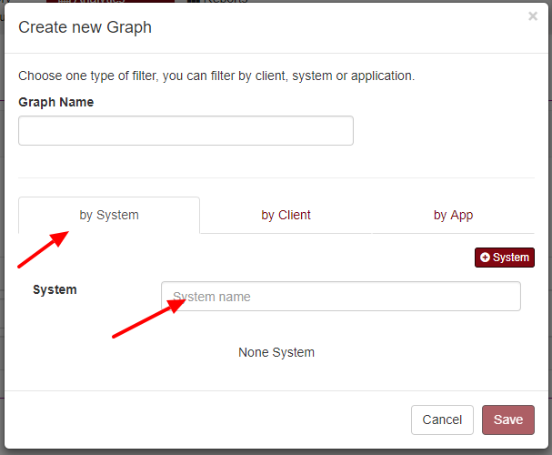
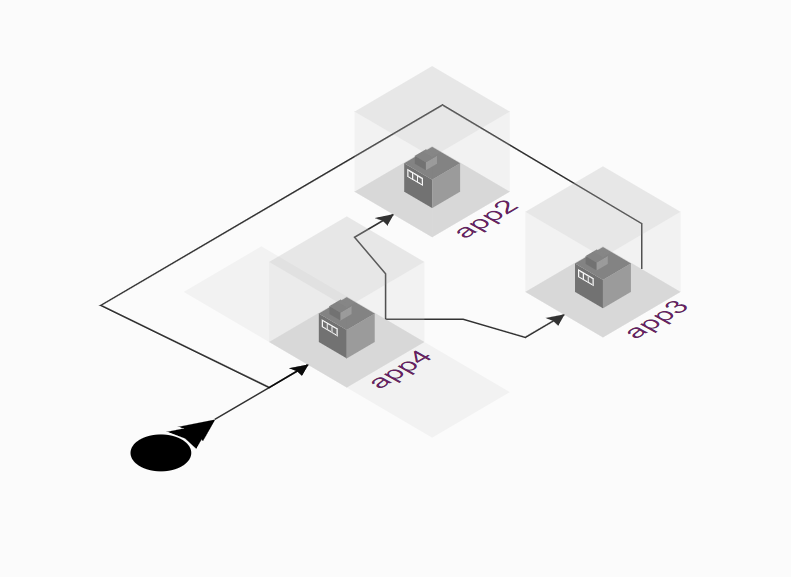
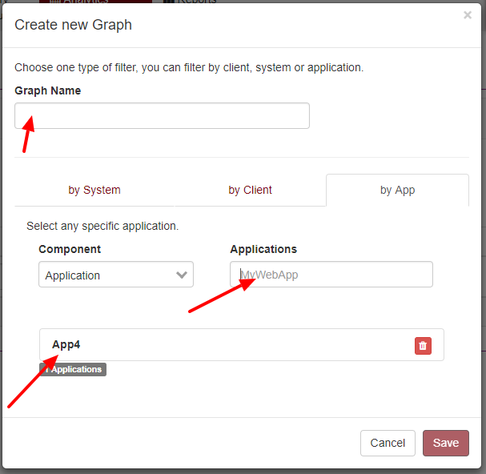
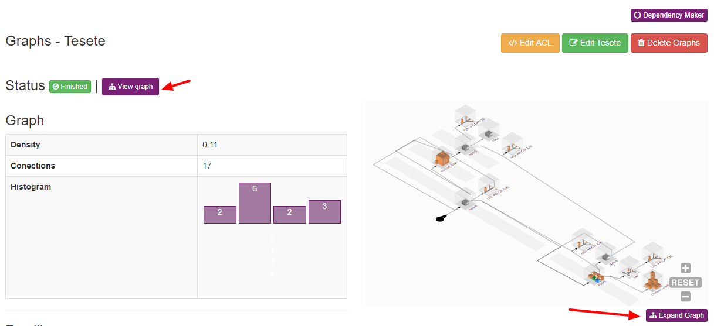
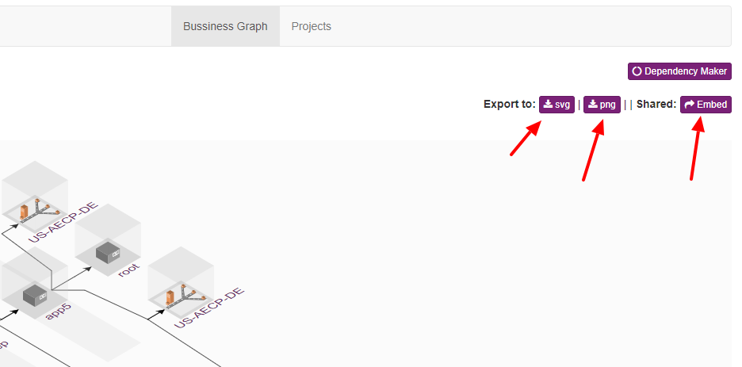
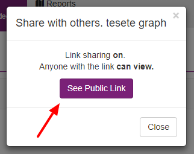

Business Graphs
================

You can create a diagram of your architecture, can be one or more systems/application.
To create a diagram, Maestro uses the dependency field, the fast way to set connections between applications it using the dependency tree feature.

Go to Analytics > business Graph > New Graph

The first modal shows three options, you can start using a client, a system or an application.

================  ============================================================
by System          It uses all entry applications set on those systems.
by Client          It uses all systems set on those clients.
by App             A entry given application
================  ============================================================

------------

Entries applications
--------------------

Entry applications are the diagram root branch, normally represents the first application hit by users, common categories are cdns, proxies, loadbalances and/or webservices.

Using the dependency tree wizard.

In this example, app4 is the entry application.

.. Note::

    You can choose with applications can be used as an entry point on each system. (On entry app tab).

------------

Creating a new diagram, selecting an entry application.

------------

You can analyses density, total connections, histograms, accountant clients, systems and applications linked on that architecture.

* **Density** - The density for undirected graphs is \[d = \frac{m}{n(n-1)},\] where \(n\) is the number of nodes and \(m\) is the number of edges in \(G\).

The density is 0 for a graph without any edges and 1 for a complete balance diagram. The density of multigraphs can be higher than 1.

More detail - `NetworkX Graph - Density <https://networkx.github.io/documentation/latest/reference/generated/networkx.classes.function.density.html/>`_.

* **Histogram** - Total by deep dependency.

You can expand the diagram.

------------

You can export the diagram in SVG, png or share that graph. Also, you can mouse over on lines to see each type of connection between each application.

------------

On a shared page, you can click on "see a public link", it will generate a shared link to embed on external tools, such as Confluence.

