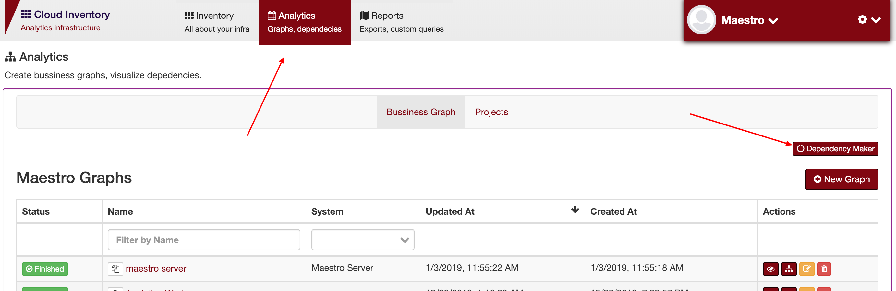
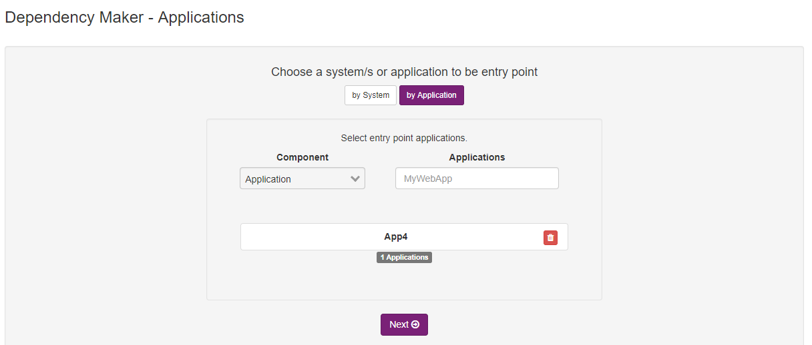
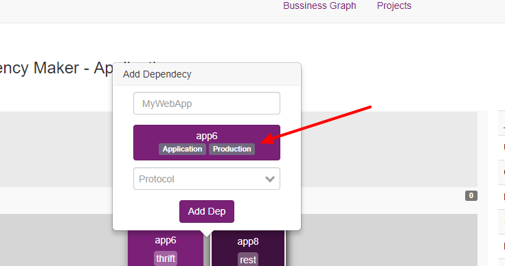
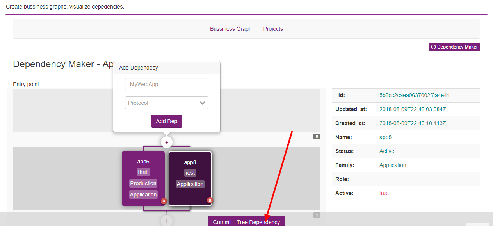

Using the dependency tree wizard
================================

To create diagrams you need to link each applications using the dependency field. However, you can use the Dependency wizard, and this feature allows you to create and connect each application in a single and fast page.

Go to dependency tree, and you can use an existed system, or a client or an application.

------------

------------

To connect in an application, you can click on plus button and select those applications; you can set the way those applications are connected, can be rest, grpc, tcp and etc.

.. image:: ../../_static/screen/dependency2.png
   :alt: Maestro Server - Create a app

------------

Clicking in an app

------------

To finish the diagram, click on commit. All done.

