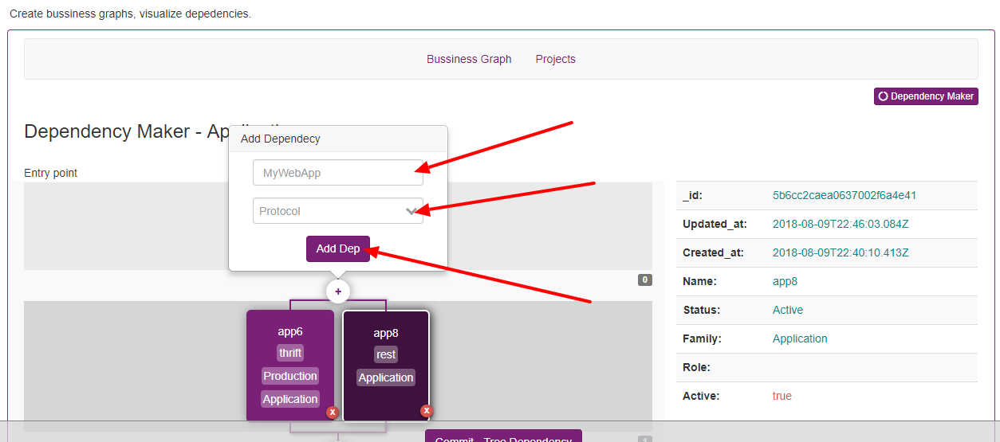

Create a dependecy tree
=======================

Dependency tree maker it's a feature which to turn easy to link dependency service, you can link an entire graph map in minutes, without access to each service and set all dependency.

Starting select a system or a entry application, these application will be the first application.

------------

.. image:: ../../_static/screen/dependency1.png

------------

After selected, you can select any application (will be active the app), and use plus button to add new dependecies.

------------

Click on app, and add to dependency

.. image:: ../../_static/screen/dependecy4.png

------------

After create the tree, salve the tree, clicking on commit button.

