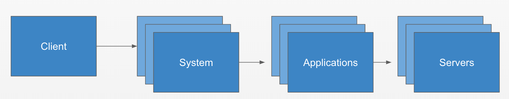

==========
User Guide
==========

In this section we will cover how the maestro server works from the user's point of view, if you want to install and configure the Maestro server you should go to the installation section, if you would like to develop a new functionality or a new service, you should go to the developer section.

Maestro is an inventory system for multi platform environments, multi-cloud for enterprise companies. It aim to organize in a single dashboard arelationship between servers, applications, systems and clients. 

The dashboard was divided into three parts:

- **Cloud inventory:** The first part you will figure out the whole inventory, such as servers, applications and systems as well as the relationship between them. In this area you can also connect third-party providers to self-discover and self-update.

- **Analytics:** In the second part you can view the relationships between applications, systems architecture, a map of dependencies and can even share these information in third-party applications as Confluence, GitHub and more.

- **Reports:** In this area you can generate advanced reports such as the list of servers for a given client.

Cloud Inventory
===============

We can use to organize each part of our architecture by:

.. toctree::
   :maxdepth: 2

   cloud_inventory/inventory/index
   cloud_inventory/autodiscovery/index
   cloud_inventory/confsettings
   cloud_inventory/history_track

Graphs - Architecture maps
==========================

.. toctree::
   :maxdepth: 2

   graphs/gpdependencies
   graphs/bussiness_graphs

Reports - Generate advanced reports
===================================

.. toctree::
   :maxdepth: 2

   reports/reports
   reports/aggregation
   reports/scheduler

ACLs- Users and Teams
=====================

.. toctree::
   :maxdepth: 2

   users/teams
   users/accessauth
