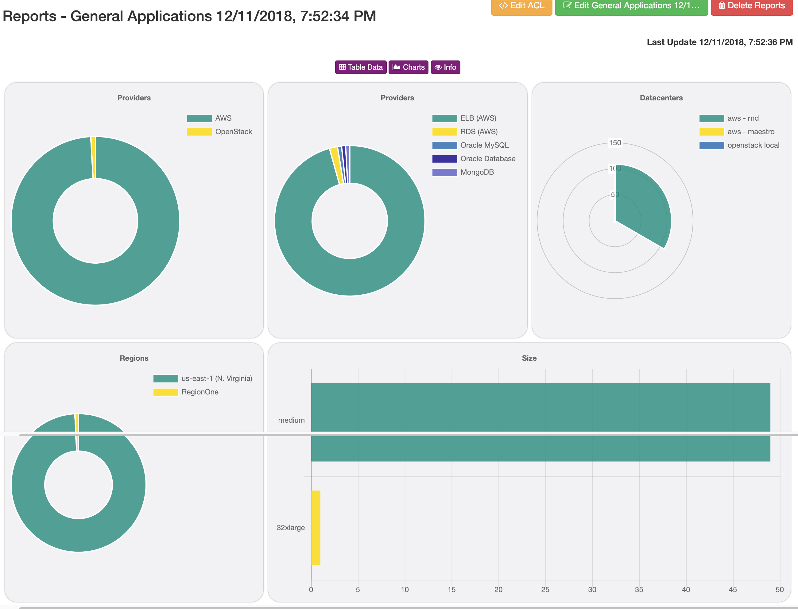
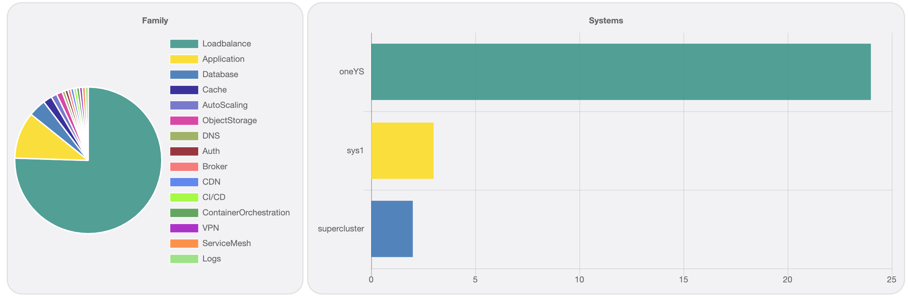

Report aggregation
==================
`Reports > Single Report > Charts`

All reports have chars overview, Maestro is smart to identify with fields can be aggregate and what chart type should use.

------------

Applications charts

------------

A list o aggregate fields:

- Datacenter - Providers
- Datacenter - Resource
- Datacenter - Instance type
- Datacenter - Regions
- Datacenter - Zones
- Tags
- Sizes
- Application - Family
- Application - Dependencies
- Application - Deploys
- System by Application
- Clients by System
- System - Entry Applications
