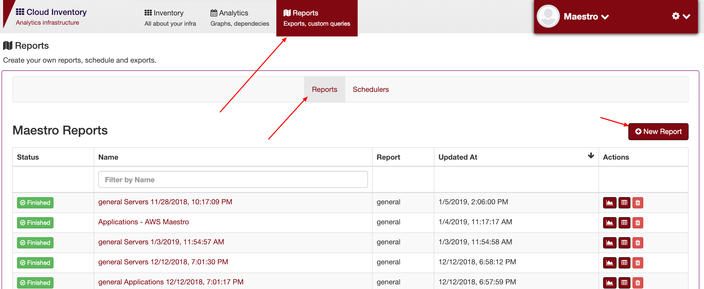
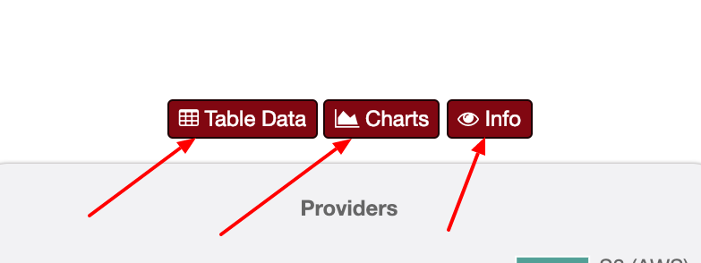

Reports
=======

Single table report
-------------------

General table able to create single report, you can add specific filters.

.. figure:: ../../_static/screen/report_c.png

     Single report, use only one entity

+---------------------------------------------------------------------------+---------+--------------------+--------------------------------------------------------------------+-------------------------------------------------+                                                                                                                                                         
|Hostname/name                                                              | string  | equal/contains     | Name or hostname                                                   | .. image:: ../../_static/screen/filter_host.png |
+---------------------------------------------------------------------------+---------+--------------------+--------------------------------------------------------------------+-------------------------------------------------+
|Ex: Hostname contais stg, will find somethiing like webserver.stg or stg2.                                                                                                                                                       |
+---------------------------------------------------------------------------+---------+--------------------+--------------------------------------------------------------------+-------------------------------------------------+

+---------------------------------------------------------------------------+---------+--------------------+--------------------------------------------------------------------+-------------------------------------------------+
|Updated_at                                                                 | date    | after/equal/before | Last data update                                                   | .. image:: ../../_static/screen/filter_data.png |
+---------------------------------------------------------------------------+---------+--------------------+--------------------------------------------------------------------+-------------------------------------------------+
|Ex: Select only the new items udated in this month                                                                                                                                                                               |
+---------------------------------------------------------------------------+---------+--------------------+--------------------------------------------------------------------+-------------------------------------------------+

+---------------------------------------------------------------------------+---------+--------------------+--------------------------------------------------------------------+
| Active                                                                    | Boolean | true/false         | Flag, used to deleted items, possibility to retrived deleted items |                                                
+---------------------------------------------------------------------------+---------+--------------------+--------------------------------------------------------------------+

--------

Pivot table reports
-------------------

Pivot reports, can create a relational table, relational is, client -> system -> app -> servers, you can use any type of filters in any step.

.. image:: ../../_static/screen/report_c2.png
   :alt: Maestro Server - Reports

Nesting relation entities.

--------

**Then each report have three pages**

- **Charts:** Show a aggregation charts of all entities
- **Table:** List a table data with results
- **Info:** Show info about the report, good for debug propose

Result report