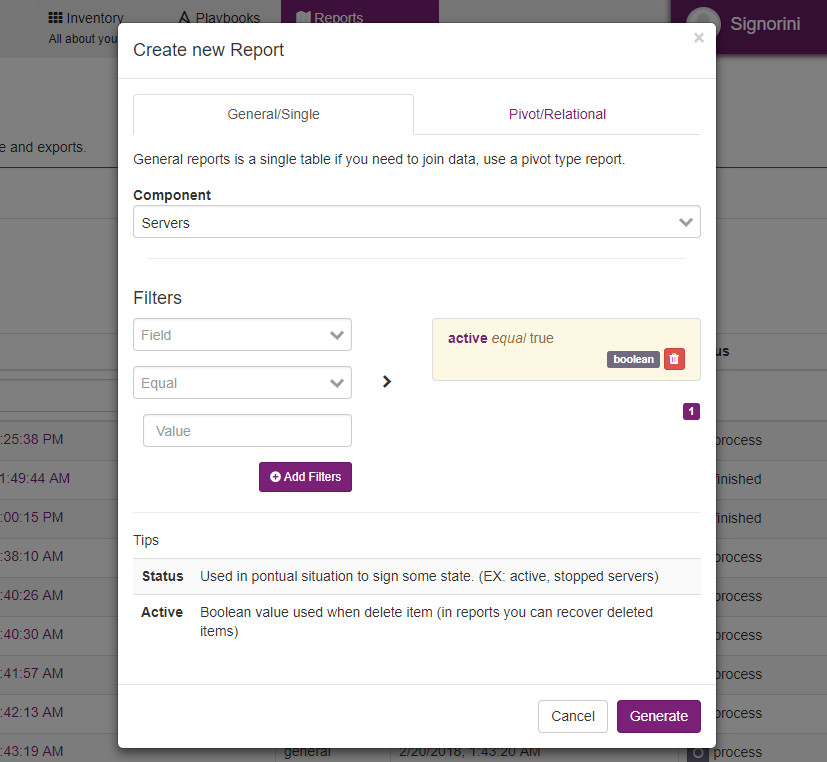
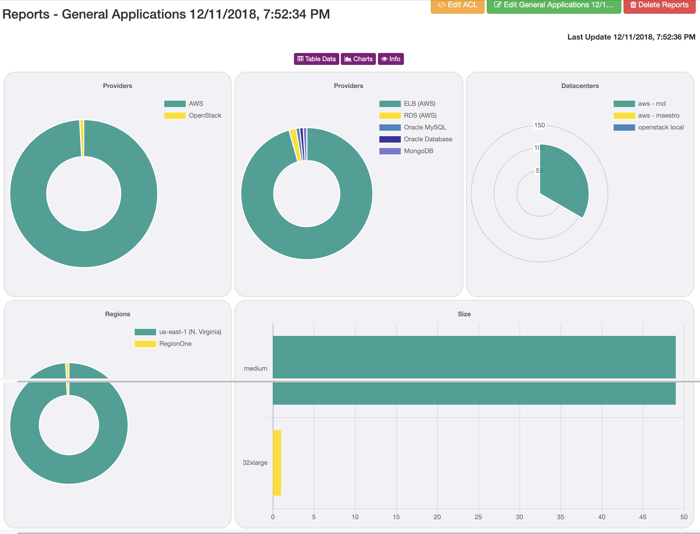
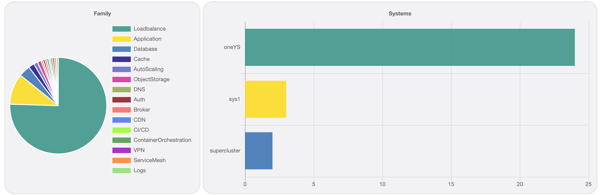

Reports
=======

Maestro has two types of reports.

- **Generic:** it is a single resource, it can have any filter
- **Pivot:** It is a multi-resource, you can create a report link clients -> system -> applications -> servers.

--------

Single table report
-------------------

The general report is a single resource report, you can add any type of filters such as by datacenters, a name, a type, any field can be used as a filter.

     Generic report

--------

Follow some filters examples:

+---------------------------------------------------------------------------+---------+--------------------+-------------------------------------------------+
|Hostname/name                                                              | string  | equal/contains     | .. image:: ../../_static/screen/filter_host.png |
+---------------------------------------------------------------------------+---------+--------------------+-------------------------------------------------+
|Get all hostname contains stg.                                                                                                                              |
+---------------------------------------------------------------------------+---------+--------------------+-------------------------------------------------+

+---------------------------------------------------------------------------+---------+--------------------+-------------------------------------------------+
|Updated_at                                                                 | date    | after/equal/before | .. image:: ../../_static/screen/filter_data.png |
+---------------------------------------------------------------------------+---------+--------------------+-------------------------------------------------+
|Select only items updated on this month                                                                                                                     |
+---------------------------------------------------------------------------+---------+--------------------+-------------------------------------------------+

--------

Pivot table reports
-------------------

Pivot reports can create reports using multiple resources, and there are well-defined connections between each resource, the order is a client -> system -> app -> servers, you can remove one resource type. However, you need to have a link between them, for example, you can create a report with clients and systems, but can't to create a client -> servers.

.. image:: ../../_static/screen/report_c2.png
   :alt: Maestro Server - Reports

Nesting resources.

--------

**Each report has three pages**

- **Charts:** Visualize the result on charts and diagrams.
- **Table:** Raw result table.
- **Info:** Information about the reports, such as status, filters and more.

.. image:: ../../_static/screen/aggr_1.png
   :alt: Maestro Server - Create charts

-------

Report Charts
==================
`Reports > Single Report > Charts`

------------

Applications charts

------------

**Aggregate fields:**

- Datacenter - Providers
- Datacenter - Resource
- Datacenter - Instance type
- Datacenter - Regions
- Datacenter - Zones
- Tags
- Sizes
- Application - Family
- Application - Dependencies
- Application - Deploys
- System by Application
- Clients by System
- System - Entry Applications
